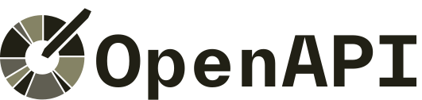

  <picture>
    <source media="(prefers-color-scheme: dark)" srcset="./images/logos/openapi-dark.svg">
    
  </picture>

  

 
 

<h1 align="center">The OpenAPI Reference</h1>

An example-rich, easy to understand reference for OpenAPI.

 

  <a href="https://www.speakeasyapi.dev/openapi"> Live Reference</a>

    <a href="https://github.com/speakeasy-api/openapi-reference-documentation/issues">Report Issue</a>
    ·
    <a href="https://github.com/speakeasy-api/openapi-reference-documentation/issues">Request Feature</a>
    ·
  <a href="https://join.slack.com/t/speakeasy-dev/shared_invite/zt-1cwb3flxz-lS5SyZxAsF_3NOq5xc8Cjw">Join Our Slack</a>
  
  

## What is this reference for?

OpenAPI is a specification for describing RESTful APIs. Functionally, it serves as a source of truth for API tooling, documentation, and testing. As such, it is essential for developers to understand the specification.

This reference is intended to be complementary of the [official OpenAPI Specification Reference](https://spec.openapis.org/oas/v3.1.0). It is focused on being dev-friendly: example-based with thorough explanations, plus AI search!

If you would like to contribute to this reference, please see the [contributing guide](CONTRIBUTING.md).

## What is Speakeasy

At Speakeasy we are building the toolchain to make APIs easy to create and consume.

Today, our platform allows you to create a robust developer experience for your API using an OpenAPI spec:

- [SDKs in 9 langues](https://www.speakeasyapi.dev/docs/create-client-sdks): TypeScript, Python, Go, Java, C#, Ruby, PHP, Swift and Unity
- [Terraform Providers](https://www.speakeasyapi.dev/docs/create-terraform)

Due to the nature of our work, we spend a lot of time working with OpenAPI and have become experts on how the spec impacts downstream workflows. This reference is a way for us to give back to the community and pass on some of the learning that we've done along the way.

## Contributing

While we have a lot of internal opinions on how to write OpenAPI, we value opinions from the community. We would love for contributions to this reference to come from a wide range of people, with different backgrounds and experiences.

This OpenAPI Reference is Open Source under the [MIT](LICENSE), and is the [copyright of its contributors](NOTICE). If you would like to contribute to the software, you must:

1. Read the Developer Certificate of Origin Version 1.1 (https://developercertificate.org/)
2. Signing all commits to the OpenAPI Reference project.

This ensures that users, distributors, and other contributors can rely on all the software related to Speakeasy being contributed under the terms of the [License](LICENSE). No contributions will be accepted without following this process.

Afterwards, navigate to the [contributing guide](CONTRIBUTING.md) to get started.

## License

This repository contains Speakeasy's OpenAPI Reference, covered under the [MIT](LICENSE), except where noted (any Daytona logos or trademarks are not covered under the Apache License, and should be explicitly noted by a LICENSE file.)

Speakeasy is a product that makes use of this open source documentation. It is distributed under our commercial terms.

Others are allowed to make their own distribution of this documentation, but they cannot use any of the Speakeasy trademarks, cloud services, etc.

## Code of Conduct

This project has adapted the Code of Conduct from the [Contributor Covenant](https://www.contributor-covenant.org/). For more information see the [Code of Conduct](CODE_OF_CONDUCT.md).

## Questions

For more information on how to use and develop Speakeasy, talk to us on
[Slack](https://join.slack.com/t/speakeasy-dev/shared_invite/zt-1cwb3flxz-lS5SyZxAsF_3NOq5xc8Cjw).
