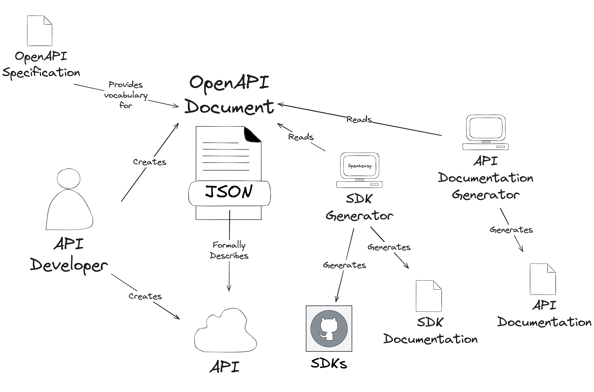

# openapi-reference-documentation

- [openapi-reference-documentation](#openapi-reference-documentation)
  - [DEVELOPMENT NOTES (REMOVE BEFORE PUBLISHING)](#development-notes-remove-before-publishing)
    - [TODOs](#todos)
  - [OPEN QUESTIONS (REMOVE BEFORE PUBLISHING)](#open-questions-remove-before-publishing)
  - [Introduction](#introduction)
    - [What is OpenAPI and why use it?](#what-is-openapi-and-why-use-it)
    - [How does this documentation differ from the official OpenAPI documentation?](#how-does-this-documentation-differ-from-the-official-openapi-documentation)
    - [Which versions of the OpenAPI Specification does this documentation cover?](#which-versions-of-the-openapi-specification-does-this-documentation-cover)
  - [OpenAPI Document Structure](#openapi-document-structure)
  - [Format and File Structure](#format-and-file-structure)
  - [Document Schema](#document-schema)
    - [Info Object](#info-object)
      - [Contact Object](#contact-object)
      - [License Object](#license-object)
      - [The Info Object in Generated SDKs](#the-info-object-in-generated-sdks)
    - [External Documentation Object](#external-documentation-object)
      - [External Documentation in Generated SDKs](#external-documentation-in-generated-sdks)
    - [Servers](#servers)
      - [Server Object](#server-object)
      - [Server Variables and Templating](#server-variables-and-templating)
      - [Server Variable Object](#server-variable-object)
      - [Servers in Generated SDKs](#servers-in-generated-sdks)
    - [Security](#security)
      - [Security Requirement Object](#security-requirement-object)
      - [Security Scheme Object](#security-scheme-object)
      - [OAuth2.0 Flow Object](#oauth20-flow-object)
      - [Example Security Scheme Schema](#example-security-scheme-schema)
      - [Security Schemes in Generated SDKs](#security-schemes-in-generated-sdks)
    - [Tags](#tags)
      - [Tag Object](#tag-object)
      - [SDK Creation](#sdk-creation)
        - [The x-speakeasy-group Extension](#the-x-speakeasy-group-extension)
        - [Multiple Namespaces](#multiple-namespaces)
        - [Define Multi-Level Namespaces](#define-multi-level-namespaces)
    - [Paths Object](#paths-object)
      - [Path Item Object](#path-item-object)
    - [Webhooks](#webhooks)
    - [Components Object](#components-object)
  - [Operation Object](#operation-object)
    - [Request Body Object](#request-body-object)
    - [Responses](#responses)
    - [Response Object](#response-object)
      - [Links](#links)
      - [Link Object](#link-object)
      - [Headers](#headers)
        - [Header Object](#header-object)
    - [Callbacks](#callbacks)
      - [Callback Object](#callback-object)
    - [Content](#content)
      - [Media Type Object](#media-type-object)
      - [Encoding Object](#encoding-object)
    - [Operation Objects in Generated SDKs](#operation-objects-in-generated-sdks)
  - [Parameters](#parameters)
    - [Parameter Object](#parameter-object)
    - [Parameter Serialization](#parameter-serialization)
      - [Query Parameters](#query-parameters)
        - [Primitive Types As Query Parameters](#primitive-types-as-query-parameters)
        - [Simple Arrays As Query Parameters](#simple-arrays-as-query-parameters)
        - [Simple Objects As Query Parameters](#simple-objects-as-query-parameters)
        - [Complex Objects and Arrays As Query Parameters](#complex-objects-and-arrays-as-query-parameters)
      - [Path Parameters](#path-parameters)
        - [Primitive Types As Path Parameters](#primitive-types-as-path-parameters)
        - [Simple Arrays As Path Parameters](#simple-arrays-as-path-parameters)
        - [Simple Objects As Path Parameters](#simple-objects-as-path-parameters)
        - [Complex Objects and Arrays As Path Parameters](#complex-objects-and-arrays-as-path-parameters)
      - [Header Parameters](#header-parameters)
        - [Primitive Types As Headers](#primitive-types-as-headers)
        - [Simple Arrays As Headers](#simple-arrays-as-headers)
        - [Simple Objects As Headers](#simple-objects-as-headers)
        - [Complex Objects and Arrays As Headers](#complex-objects-and-arrays-as-headers)
      - [Cookie Parameters](#cookie-parameters)
        - [Primitive Types As Cookies](#primitive-types-as-cookies)
        - [Simple Arrays As Cookies](#simple-arrays-as-cookies)
        - [Simple Objects As Cookies](#simple-objects-as-cookies)
        - [Complex Objects and Arrays As Cookies](#complex-objects-and-arrays-as-cookies)
  - [Schema Object](#schema-object)
    - [Composition and Inheritance](#composition-and-inheritance)
    - [Discriminator Object](#discriminator-object)
    - [XML Object](#xml-object)
    - [Examples](#examples)
      - [Example Object](#example-object)
  - [Extensions](#extensions)
  - [References](#references)
    - [OpenAPI Reference Object](#openapi-reference-object)
    - [JSON Schema References](#json-schema-references)
      - [Absolute References](#absolute-references)
      - [Relative References](#relative-references)
    - [Expression](#expression)
  - [Data Type Formats](#data-type-formats)

## DEVELOPMENT NOTES (REMOVE BEFORE PUBLISHING)

- I believe this should be an open source repo that we can use to showcase the docs and example SDKs generated from our example openapi document. This will allow things to be co-located (we can locate them separately but I think we will lose some coherency with that approach), benefit from community updates and improvements.
- I am building a `speakeasy` example openapi document as an example document similar to the petstore from swagger. The speakeasy it refers to is a bar, so everything is themed around that. I think this will be a good way to showcase the documentation and SDKs.
- I imagine the `SDK Generation` sections to actually be some sort of expandable section that can be toggled open and closed. This would allow the user to see the docs related to SDK Generation without it taking up too much space on the page. I also imagine we will potentially show examples in all the supported languages, via tabs or something similar.

### TODOs

- TODO: Go through and update all examples of yaml and generated code once full documentation and example spec is complete.
- TODO: Ensure we refer to API, Endpoint, etc consistently throughout the documentation.
- TODO: Determine the best way to link back to the generator? Should we talk directly about it in this documentation, or leave it to links and/or expandable sections that go into more detail?
- ~~TODO~~DONE: make the difference between OpenAPI references and JSON Schema references clear. I think this is a common point of confusion for people.
- TODO: do we want to add comments into our examples explaining them more?
- TODO: in some cases the smart bear docs document different sections of the spec in a lot of detail, almost as "how-to" guides ie. <https://swagger.io/docs/specification/callbacks/> I think we should have the equivelant but should that be done inline in this documentation or as separate linked pages from here? List of potential candidates:
  - callbacks
  - webhooks
  - parameters (have implemented this in a lot of detail in line in this documentation but should we break it out into a separate page?)
  - components
  - references
  - ???

## OPEN QUESTIONS (REMOVE BEFORE PUBLISHING)

- Do we want to be able to link to rows in the tables? If so we can add ids for each field name like so: <https://stackoverflow.com/questions/68983152/how-do-i-create-a-link-to-a-certain-word-in-markdown>

## Introduction

Whether creating or consuming web services, developers understand the importance of API design. An API that developers enjoy interacting with can turn a SaaS business into a platform.

But even if we spend years polishing the perfectly RESTful API, it is unlikely to lead anywhere without clear and accurate documentation, supported by SDKs that delight developer-users.

However, the quest of keeping documentation up to date and maintaining usable SDKs in multiple programming languages is beyond the reach of most startups.

One way to overcome this bump in the road to growth is to adopt a formal specification for APIs. Instead of creating documentation and multiple SDKs by hand, a formal API specification allows anyone to generate documentation, SDKs, and even server-side API endpoints.

OpenAPI fits the bill, and we'd like to help you understand this powerful tool.

### What is OpenAPI and why use it?

When we refer to OpenAPI, we most often mean the **OpenAPI Specification** - a standardized document structure for describing HTTP APIs in a way that humans and computers can understand.

To use OpenAPI, you create a JSON or YAML file that describes your API using the vocabulary provided by the OpenAPI Specification - we'll call this JSON or YAML file an **OpenAPI document**.

A valid OpenAPI document can serve as a blueprint when generating documentation and SDKs. An app or library that reads an OpenAPI document to generate SDKs or documentation is called a **generator**.

Here's how these concepts fit together:



At the center of the OpenAPI workflow, we have the OpenAPI document - the blueprint for our API, a recipe for creating SDKs, and a source of truth for our documentation.

To create and maintain an OpenAPI document, we need to understand the OpenAPI Specification.

This documentation will help you understand the OpenAPI Specification.

### How does this documentation differ from the official OpenAPI documentation?

Official documentation for the OpenAPI Specification, while thorough and complete, focuses on formal definition before usability. We aim to provide a gentler and more practical introduction without sacrificing accuracy.

This documentation combines a simpler description of the specification with examples from a working API.

We've structured the documentation according to the needs of OpenAPI users of any skill level.

Instead of jumping head-first into the specification, find an entry point that suites your current understanding and goals:

- To **learn about OpenAPI by building an API** work through our [OpenAPI tutorials](./tutorial/README.md), where we create an OpenAPI document from scratch, then generate server endpoint stubs, SDKs, and documentation.
- Follow [step-by-step guides](./guides/README.md) on **how to accomplish specific tasks using OpenAPI**.
- Reference a **detailed description** of the [OpenAPI Specification](./specification/README.md).
- Understand OpenAPI terminology by referencing the [OpenAPI Glossary](./glossary/README.md).
- Understand **OpenAPI best practices** by reading our [OpenAPI tips and advice](./tips/README.md).
- See our detailed **OpenAPI document example** in the [Speakeasy Bar API](./example/README.md).

If you have no idea where to start, we recommend working through our [OpenAPI tutorial](./tutorials/README.md) to get the wheels turning.

### Which versions of the OpenAPI Specification does this documentation cover?

This documentation will cover versions `3.0.x` and `3.1.x` of the OpenAPI specification. Where there is an important difference between the two versions, we will call it out specifically, otherwise the documentation will apply to both versions.

## OpenAPI Document Structure

An OpenAPI document is made up of several different sections, each of which is described in detail below.

Example:

```yaml
openapi: 3.1.0
info:
  title: The Speakeasy Bar
  version: 1.0.0
servers:
  - url: https://speakeasy.bar
    description: The production server
security:
  - apiKey: []
paths:
  /drinks:
    get:
      operationId: listDrinks
      summary: Get a list of drinks
      responses:
        "200":
          description: A list of drinks
          content:
            application/json:
              schema:
                type: array
                items:
                  $ref: "#/components/schemas/Drink"
components:
  schemas:
    Drink:
      type: object
      properties:
        name:
          type: string
        price:
          type: number
  securitySchemes:
    apiKey:
      type: apiKey
      name: Authorization
      in: header

```

| Field               |                              Type                               |      Required      | Description                                                                                                                                                                                                                                                                                                                                                                                                                                                                                                           |
| ------------------- | :-------------------------------------------------------------: | :----------------: | --------------------------------------------------------------------------------------------------------------------------------------------------------------------------------------------------------------------------------------------------------------------------------------------------------------------------------------------------------------------------------------------------------------------------------------------------------------------------------------------------------------------- |
| `openapi`           |                            String                             | :heavy_check_mark: | The version of the OpenAPI Specification that the document conforms to, should be one of the [supported versions](https://github.com/OAI/OpenAPI-Specification/tree/main/versions).<br /><br />**Note:** Speakeasy tooling currently only supports versions `3.0.x` and `3.1.x` of the OpenAPI Specification.                                                                                                                                                                         |
| `jsonSchemaDialect` |                            String                             | :heavy_minus_sign: | **(Available in OpenAPI 3.1.x ONLY)**<br />The version of the JSON Schema specification the document conforms to (if not provided by the `$schema` field in a [Schema Object](#schema-object)), in the form of a URI to one of the [supported versions](https://json-schema.org/specification-links.html#published-drafts).<br /><br /> **Note:** Currently **not** supported by Speakeasy tooling.                                                                                   |
| `info`              |                   [Info Object](#info-object)                   | :heavy_check_mark: | Contains information about the document including fields like `title`, `version`, and `description` that help to identify the purpose and owner of the document.                                                                                                                                                                                                                                                                                                                                                          |
| `externalDocs`      | [External Documentation Object](#external-documentation-object) | :heavy_minus_sign: | Optional documentation about the API available externally.                                                                                                                                                                                                                                                                                                                                                                                                                                                            |
| `x-*`               |                    [Extensions](#extensions)                    | :heavy_minus_sign: | Any number of extension fields can be added to the document (for example, [`x-speakeasy-name-overrides`](https://speakeasyapi.dev/docs/using-speakeasy/create-client-sdks/customize-sdks/methods/#change-method-names) that allows the default generated method names of operations to be overridden) that can be used by tooling and vendors to add additional metadata and functionality to the OpenAPI Specification. When provided at the global level, the extensions generally apply to the entire document. |
| `servers`           |                       [Servers](#servers)                       | :heavy_minus_sign: | Contains an optional list of servers the API is available on. If not provided, the default URL is assumed to be `/`, a path relative to where the OpenAPI document is hosted.                                                                                                                                                                                                                                                                                                                                           |
| `security`          |                      [Security](#security)                      | :heavy_minus_sign: | Contains an optional list of security requirements that apply to all operations in the API. If not provided, the default security requirements are assumed to be `[]`, an empty array.                                                                                                                                                                                                                                                                                                                                 |
| `tags`              |                          [Tags](#tags)                          | :heavy_minus_sign: | Contains an optional list of tags that are generally used to group or categorize a set of [Operations](#operation-object).                                                                                                                                                                                                                                                                                                                                                                                            |
| `paths`             |                  [Paths Object](#paths-object)                  | :heavy_minus_sign: | Contains the paths and operations available within the API.                                                                                                                                                                                                                                                                                                                                                                                                                                                           |
| `webhooks`          |                      [Webhooks](#webhooks)                      | :heavy_minus_sign: | **(Available in OpenAPI 3.1.x ONLY)**<br />Contains an optional list of incoming webhooks that the API consumer can subscribe to.                                                                                                                                                                                                                                                                                                                                                                                     |
| `components`        |             [Components Object](#components-object)             | :heavy_minus_sign: | Contains an optional list of reusable components that can be referenced from other parts of the document.                                                                                                                                                                                                                                                                                                                                                                                                             |

The above order of fields is recommended (but is not required by the OpenAPI Specification) as it allows the stage to be set in terms of calling out key information like details about the API, where it is available, what security is required to access it, and then flows into defining the available endpoints before getting into the details of the components that make up the API.

## Format and File Structure

An OpenAPI document is a JSON or YAML file that contains either an entire API definition or a partial definition of an API and/or its components. All field names in the specification are case-sensitive unless otherwise specified.

A document can be split into multiple files, and the files can be in different formats. For example, you can have a JSON file that contains the API definition and a YAML file that contains the components, or a collection of files that contain partial definitions of the API and its components.

Generally, the main API definition file is called `openapi.json` or `openapi.yaml`, and the component files are called `components.json` or `components.yaml`, though this is not a requirement.

Some common organizational patterns for OpenAPI documents are:

- A single file that contains the entire API definition.
- A main file that contains the API definition and a components file that contains the components.
  - This is normally achieved by using the `$ref` keyword to reference the components file from the main file. [Click here for more information on references](#references).
- A collection of files that contain partial definitions of the API and its components.
  - Some tools support this pattern by allowing multiple files to be provided. Others, such as the Speakeasy Generator, require the individual files to be merged into a single file before being passed to the tool, which can be achieved using the Speakeasy CLI tool. [Click here for more information on the Speakeasy CLI merge tool](https://speakeasyapi.dev/docs/speakeasy-cli/merge/).

## Document Schema

### Info Object

The document's `info` object contains information about the document, including fields like `title`, `version`, and `description` that help to identify the purpose and owner of the document.

Example:

```yaml
openapi: 3.1.0
info:
  title: The Speakeasy Bar
  version: 1.0.0
  summary: A bar that serves drinks
  description: A secret underground bar that serves drinks to those in the know.
  contact:
    name: Speakeasy Support
    url: https://support.speakeasy.bar
    email: support@speakeasy.bar
  license:
    name: Apache 2.0
    url: https://www.apache.org/licenses/LICENSE-2.0.html
  termsOfService: https://speakeasy.bar/terms
```

| Field            |               Type                |      Required      | Description                                                                                                                                                                       |
| ---------------- | :-------------------------------: | :----------------: | --------------------------------------------------------------------------------------------------------------------------------------------------------------------------------- |
| `title`          |             String              | :heavy_check_mark: | A name for the API contained within the document.                                                                                                                                 |
| `version`        |             String              | :heavy_check_mark: | The version of this OpenAPI document, *not* the version of the API or the OpenAPI Specification used. This is recommended to be a [Semantic Version](https://semver.org/).        |
| `summary`        |             String              | :heavy_minus_sign: | **(Available in OpenAPI 3.1.x ONLY)**<br />A short sentence summarizing the API contained with the document.                                                                      |
| `description`    |             String              | :heavy_minus_sign: | A longer description of the API contained within the document. This may contain [CommonMark syntax](https://spec.commonmark.org/) to provide a rich description.                  |
| `contact`        | [Contact Object](#contact-object) | :heavy_minus_sign: | Contact information for the maintainer of the API.<br /><br /> **Note:** Currently not supported by Speakeasy tooling.                                                               |
| `license`        | [License Object](#license-object) | :heavy_minus_sign: | The license the API is made available under.                                                                                                                                      |
| `termsOfService` |             String              | :heavy_minus_sign: | A URL to the terms of service for the API.                                                                                                                                        |
| `x-*`            |     [Extensions](#extensions)     | :heavy_minus_sign: | Any number of extension fields can be added to the info object that can be used by tooling and vendors to add additional metadata and functionality to the OpenAPI Specification. |

The above order of fields is recommended (but is not required by the OpenAPI specification) as it puts the most important information first and allows the reader to get a quick overview of the document and API.

#### Contact Object

Contact information for the maintainer of the API.

| Field   |           Type            |      Required      | Description                                                                                                |
| ------- | :-----------------------: | :----------------: | ---------------------------------------------------------------------------------------------------------- |
| `name`  |         String          | :heavy_minus_sign: | The name of a contact that could be approached, for example, for support.                                    |
| `url`   |         String         | :heavy_minus_sign: | A URL to a website or similar providing contact information.                                               |
| `email` |         String          | :heavy_minus_sign: | An email address for the contact.                                                                          |
| `x-*`   | [Extensions](#extensions) | :heavy_minus_sign: | Any number of extension fields can be added to the contact object that can be used by tooling and vendors. |

#### License Object

The license the API is made available under.

| Field        |           Type            |      Required      | Description                                                                                                                                 |
| ------------ | :-----------------------: | :----------------: | ------------------------------------------------------------------------------------------------------------------------------------------- |
| `name`       |         String          | :heavy_check_mark: | The name of the license.                                                                                                                    |
| `identifier` |         String          | :heavy_minus_sign: | **(Available in OpenAPI 3.1.x ONLY)**<br/>An [SPDX identifier](https://spdx.org/licenses/) for the license. Provided only if `url` isn't set. |
| `url`        |         String          | :heavy_minus_sign: | A URL to the license information. Provided only if `identifier` isn't set.                                                                    |
| `x-*`        | [Extensions](#extensions) | :heavy_minus_sign: | Any number of extension fields can be added to the license object that can be used by tooling and vendors.                                  |

#### The Info Object in Generated SDKs

The Speakeasy SDK Generator uses the `info` object to produce code comments and documentation for the generated SDKs. If [external documentation](#external-documentation-object) is also provided at the document level, this will be included in the generated comments, too.

For example:

```go
// Speakeasy - A bar that serves drinks
// A secret underground bar that serves drinks to those in the know.
type Speakeasy struct {
```

### External Documentation Object

Allows for providing information about external documentation available for the API, Operation, Tag, or Schema.

| Field         |           Type            |      Required      | Description                                                                                                                               |
| ------------- | :-----------------------: | :----------------: | ----------------------------------------------------------------------------------------------------------------------------------------- |
| `url`         |         String          | :heavy_check_mark: | A URL to the external documentation.                                                                                                      |
| `description` |         String          | :heavy_minus_sign: | A description of the external documentation. [CommonMark syntax](https://spec.commonmark.org/) can be used to provide a rich description. |
| `x-*`         | [Extensions](#extensions) | :heavy_minus_sign: | Any number of extension fields can be added to the external documentation object that can be used by tooling and vendors.                 |

#### External Documentation in Generated SDKs

The Speakeasy SDK Generator uses the `externalDocs` object to produce code comments and documentation for the generated SDKs. These will be included alongside comments for any of the Methods ([Operations](#operation-object)), Classes or Enums ([Object Schemas](#schema-object)), or SDK ([Tags](#tags)) that reference the `externalDocs` object.

For example:

```go
// Speakeasy - A bar that serves drinks
// A secret underground bar that serves drinks to those in the know.
// https://docs.speakeasy.bar - The Speakeasy Bar Documentation
type Speakeasy struct {
```

### Servers

A list of [Server Objects](#server-object) that either the entire API or a specific path or operation is available on. Servers can be defined at the [Document](#document-structure) level, the [Path](#paths-object) level, or the [Operation](#operation-object) level.

Servers are optional in the OpenAPI specification. If not provided, the default URL is assumed to be `/`, a path relative to where the OpenAPI document is hosted.

Generally, the first server in the list is considered to be the default server to use, with logic to select other servers to use left up to tooling or the API consumer.

Example:

```yaml
servers:
  - url: https://speakeasy.bar
    description: The production server
  - url: https://staging.speakeasy.bar
    description: The staging server
```

If a list of servers is provided at the `paths` level, the servers will override any servers provided at the document level. If a list of servers is provided at the `operation` level, the servers will override any servers provided at the `paths` and document levels.

#### Server Object

A Server Object describes a single server that is available for the API.

| Field         |                       Type                        |      Required      | Description                                                                                                                                                                                                                                                                                                                |
| ------------- | :-----------------------------------------------: | :----------------: | -------------------------------------------------------------------------------------------------------------------------------------------------------------------------------------------------------------------------------------------------------------------------------------------------------------------------- |
| `url`         |                     String                      | :heavy_check_mark: | A URL to the server. This can be an absolute URL or a relative URL to the hosted location of the OpenAPI document. The URL also supports variable substitutions via [Templating](#server-variables--templating).                                                                                                      |
| `description` |                     String                      | :heavy_minus_sign: | A description of the server. [CommonMark syntax](https://spec.commonmark.org/) can be used to provide a rich description.                                                                                                                                                                                                  |
| `variables`   | [Server Variables](#server-variables--templating) | :heavy_minus_sign: | A map of variable names to [Server Variable Objects](#server-variable-object) that can be used for variable substitution via [Templating](#server-variables--templating).                                                                                                                                                  |
| `x-*`         |             [Extensions](#extensions)             | :heavy_minus_sign: | Any number of extension fields can be added to the Server Object (for example, [`x-speakeasy-server-id`](https://speakeasyapi.dev/docs/archive/server-urls/#speakeasy-server-extensions) that allows IDs to be assigned to each server for easier selection via Speakeasy SDKs) that can be used by tooling and vendors. |

If the URL is an absolute path, it ***must*** conform to [RFC 3986](https://datatracker.ietf.org/doc/html/rfc3986) (`schema://host{:port}{/path}`) and not include the query string, and ***must*** be URL encoded (except for the templating delimiters `{}` if not part of the URL).

The URL can also be a relative path to where the OpenAPI document is hosted (`/api`). For a document hosted at `https://speakeasy.bar/openapi.yaml`, the resulting URL will be `https://speakeasy.bar/api`.

The URL may also contain fragments (for example, `https://speakeasy.bar/drinks#mocktails`) allowing for repeated URLs with different fragments to be defined in the same document and the definition of multiple operations with the same URL and HTTP method but different operation definitions.

For example, the below document is not valid as it defines two operations with the same URL and HTTP method:

```yaml
paths:
  /drinks:
    get:
      operationId: listCocktails
      summary: Get a list of cocktails
      parameters:
        - name: type
          in: query
          schema:
            type: string
            const: cocktail
      responses:
        "200":
          description: A list of cocktails
          content:
            application/json:
              schema:
                type: array
                items:
                  $ref: "#/components/schemas/Cocktail"
  /drinks:
    get:
      operationId: listMocktails
      summary: Get a list of mocktails
      parameters:
        - name: type
          in: query
          schema:
            type: string
            const: mocktail
      responses:
        "200":
          description: A list of mocktails
          content:
            application/json:
              schema:
                type: array
                items:
                  $ref: "#/components/schemas/Mocktail"
```

However, the below document is valid as it defines two operations with the same URL and HTTP method but different fragments, making the paths unique:

```yaml
paths:
  /drinks#cocktails:
    get:
      operationId: listCocktails
      summary: Get a list of cocktails
      parameters:
        - name: type
          in: query
          schema:
            type: string
            const: cocktail
      responses:
        "200":
          description: A list of cocktails
          content:
            application/json:
              schema:
                type: array
                items:
                  $ref: "#/components/schemas/Cocktail"
  /drinks#mocktails:
    get:
      operationId: listMocktails
      summary: Get a list of mocktails
      parameters:
        - name: type
          in: query
          schema:
            type: string
            const: mocktail
      responses:
        "200":
          description: A list of mocktails
          content:
            application/json:
              schema:
                type: array
                items:
                  $ref: "#/components/schemas/Mocktail"
```

**Note:** The above API can also be achieved using [`oneOf`](#composition-and-inheritance) in a single operation definition, but depending on the use case, this may not be desirable.

#### Server Variables and Templating

Server variables are a map of variable names (string) to [Server Variable Objects](#server-variable-object) that can be used for variable substitution via Templating.

Example:

```yaml
servers:
  - url: https://{organization}.{environment}.speakeasy.bar
    description: A per-organization and per-environment API
    variables:
      organization:
        description: The organization name. Defaults to a generic organization.
        default: api
      environment:
        description: The environment name. Defaults to the production environment.
        default: prod
        enum:
          - prod
          - staging
          - dev
```

Any variable delimited by `{}` in the `url` field declares a part of the URL that ***must*** be replaced with a value and references a variable that ***must*** be defined in the `variables` map. It is the API consumer's responsibility to replace these variables (including the delimiters) with values to create a valid URL before making a request to the API. The defined `default` should be used if no other value is provided.

#### Server Variable Object

A Server Variable Object describes a single variable that is optionally part of the URL in a [Server Object](#server-object). The value of a variable can be any arbitrary string value unless a list of allowed values is provided via the `enum` field.

| Field         |           Type            |      Required      | Description                                                                                                                                              |
| ------------- | :-----------------------: | :----------------: | -------------------------------------------------------------------------------------------------------------------------------------------------------- |
| `description` |         String          | :heavy_minus_sign: | A description of the variable. [CommonMark syntax](https://spec.commonmark.org/) can be used to provide a rich description.                              |
| `default`     |         String          | :heavy_check_mark: | The default value of the variable. A variable is always of type *string*. If `enum` is provided this ***must*** be one of the values in the `enum` list. |
| `enum`        |     List\<string\>      | :heavy_minus_sign: | A list of allowed string values for the variable.                                                                                                      |
| `x-*`         | [Extensions](#extensions) | :heavy_minus_sign: | Any number of extension fields can be added to the Server Variable Object that can be used by tooling and vendors.                                       |

#### Servers in Generated SDKs

The Speakeasy SDK Generator generally requires at least one absolute URL to be provided to ensure the out-of-the-box experience is as smooth as possible for developers using the generated SDKs. If not present in the OpenAPI document, an absolute URL can be provided via configuration. [Click here for more details](https://speakeasyapi.dev/docs/using-speakeasy/create-client-sdks/customize-sdks/servers/#declare-base-server-url).

Generated SDKs will contain a list of available servers that can be used with the SDK. The first server in the list is considered to be the default server to use and will be used if no other server is provided when initializing the SDK (in the case of global servers) or when using a method (in the case of path or operation servers).

For global servers, some of the generated code will look like this:

```go
// speakeasy.go

// ServerList contains the list of servers available to the SDK
var ServerList = []string{
    // The production server
    "https://speakeasy.bar",
    // The staging server
    "https://staging.speakeasy.bar",
}

// WithServerURL allows the overriding of the default server URL
func WithServerURL(serverURL string) SDKOption {
    return func(sdk *Speakeasy) {
        sdk.sdkConfiguration.ServerURL = serverURL
    }
}

// WithTemplatedServerURL allows the overriding of the default server URL with a templated URL populated with the provided parameters
func WithTemplatedServerURL(serverURL string, params map[string]string) SDKOption {
    return func(sdk *Speakeasy) {
        if params != nil {
            serverURL = utils.ReplaceParameters(serverURL, params)
        }

        sdk.sdkConfiguration.ServerURL = serverURL
    }
}

// WithServerIndex allows the overriding of the default server by index
func WithServerIndex(serverIndex int) SDKOption {
    return func(sdk *Speakeasy) {
        if serverIndex < 0 || serverIndex >= len(ServerList) {
            panic(fmt.Errorf("server index %d out of range", serverIndex))
        }

        sdk.sdkConfiguration.ServerIndex = serverIndex
    }
}
```

The code above is used like this:

```go
// Create a new Speakeasy SDK Instance using the default server
s := speakeasy.New(
    speakeasy.WithSecurity(shared.Security{
        APIKey: "YOUR_API_KEY_HERE",
    }),
)

// Create a new Speakeasy SDK Instance using the staging server via index
s := speakeasy.New(
    speakeasy.WithSecurity(shared.Security{
        APIKey: "YOUR_API_KEY_HERE",
    }),
    speakeasy.WithServerIndex(1),
)

// Create a new Speakeasy SDK Instance using the staging server via URL
s := speakeasy.New(
    speakeasy.WithSecurity(shared.Security{
        APIKey: "YOUR_API_KEY_HERE",
    }),
    speakeasy.WithServerURL(speakeasy.ServerList[1]),
)

// Create a new Speakeasy SDK Instance using an arbitrary server URL
s := speakeasy.New(
    speakeasy.WithSecurity(shared.Security{
        APIKey: "YOUR_API_KEY_HERE",
    }),
    speakeasy.WithServerURL("http://localhost:8080"),
)

// Create a new Speakeasy SDK Instance using a templated server URL
s := speakeasy.New(
    speakeasy.WithSecurity(shared.Security{
        APIKey: "YOUR_API_KEY_HERE",
    }),
    speakeasy.WithServerURL("http://{environment}.speakeasy.bar", map[string]string{
        "environment": "staging",
    }),
)
```

For path and operation servers, the default server will be used when using a method if no other URL is provided. For example:

```go
// Create a new Speakeasy SDK Instance
s := speakeasy.New(
    speakeasy.WithSecurity(shared.Security{
        APIKey: "YOUR_API_KEY_HERE",
    }),
)

// Using an arbitrary server URL
res := s.GetDrink(ctx, operations.GetDrinkRequest{ Name: "Old Fashioned" }, operations.WithServerURL("http://localhost:8080"))
```

The developer experience of SDKs can be improved when providing multiple servers that can be selected by using [`x-speakeasy-server-id`](https://speakeasyapi.dev/docs/archive/server-urls/#speakeasy-server-extensions) to assign IDs to each server. This allows the generator to generate a map of servers and provide methods for selecting a server by ID. For example:

```go
// speakeasy.go

const (
	// ServerProd - The production server
	ServerProd string = "prod"
	// ServerStaging - The staging server
	ServerStaging string = "staging"
)

// ServerList contains the list of servers available to the SDK
var ServerList = map[string]string{
	ServerProd:    "https://speakeasy.bar",
	ServerStaging: "https://staging.speakeasy.bar",
}

// WithServer allows the overriding of the default server by name
func WithServer(server string) SDKOption {
	return func(sdk *Speakeasy) {
		_, ok := ServerList[server]
		if !ok {
			panic(fmt.Errorf("server %s not found", server))
		}

		sdk.sdkConfiguration.Server = server
	}
}
```

The code above is used like this:

```go
// Create a new Speakeasy SDK Instance using the staging server via ID
s := speakeasy.New(
    speakeasy.WithSecurity(shared.Security{
        APIKey: "YOUR_API_KEY_HERE",
    }),
    speakeasy.WithServer(speakeasy.ServerStaging),
)
```

When server variables are used, the SDK Generator will generate methods for setting the values of the variables. For example:

```go
// speakeasy.go


// ServerEnvironment - The environment name. Defaults to the production environment.
type ServerEnvironment string

const (
	ServerEnvironmentProd    ServerEnvironment = "prod"
	ServerEnvironmentStaging ServerEnvironment = "staging"
	ServerEnvironmentDev     ServerEnvironment = "dev"
)

func (e ServerEnvironment) ToPointer() *ServerEnvironment {
	return &e
}

func (e *ServerEnvironment) UnmarshalJSON(data []byte) error {
	var v string
	if err := json.Unmarshal(data, &v); err != nil {
		return err
	}
	switch v {
	case "prod":
		fallthrough
	case "staging":
		fallthrough
	case "dev":
		*e = ServerEnvironment(v)
		return nil
	default:
		return fmt.Errorf("invalid value for ServerEnvironment: %v", v)
	}
}

// WithEnvironment allows setting the $name variable for url substitution
func WithEnvironment(environment ServerEnvironment) SDKOption {
	return func(sdk *Speakeasy) {
		for idx := range sdk.sdkConfiguration.ServerDefaults {
			if _, ok := sdk.sdkConfiguration.ServerDefaults[idx]["environment"]; !ok {
				continue
			}

			sdk.sdkConfiguration.ServerDefaults[idx]["environment"] = fmt.Sprintf("%v", environment)
		}
	}
}

// WithOrganization allows setting the $name variable for url substitution
func WithOrganization(organization string) SDKOption {
	return func(sdk *Speakeasy) {
		for idx := range sdk.sdkConfiguration.ServerDefaults {
			if _, ok := sdk.sdkConfiguration.ServerDefaults[idx]["organization"]; !ok {
				continue
			}

			sdk.sdkConfiguration.ServerDefaults[idx]["organization"] = fmt.Sprintf("%v", organization)
		}
	}
}
```

This code is used as follows:

```go
// Create a new Speakeasy SDK Instance setting the environment and organization variables
s := speakeasy.New(
    speakeasy.WithSecurity(shared.Security{
        APIKey: "YOUR_API_KEY_HERE",
    }),
    speakeasy.WithEnvironment(speakeasy.ServerEnvironmentStaging),
    speakeasy.WithOrganization("speakeasy"),
)
```

### Security

The `security` section is a list of [Security Requirement Objects](#security-requirement-object) that apply to all operations in the API (if defined at the [document](#document-structure) level) or to a specific operation (if defined at the [operation](#operation-object) level).

Operation-level security requirements override any security requirements defined at the document level.

If not provided at the document level, the default security requirements are assumed to be `[]`, an empty array, meaning no security is required to access the API.

Example:

```yaml
security:
  - apiKey: []
components:
  securitySchemes:
    apiKey:
      type: apiKey
      name: Authorization
      in: header
```

The named security schemes referenced ***must*** be [Security Scheme Objects](#security-scheme-object) defined in the [Components Object](#components-object) under the `securitySchemes` field.

Security can also be made optional by providing an empty object (`{}`) in the list of security requirements. For example:

```yaml
security:
  - apiKey: []
  - {}
```

Security can also be disabled for a specific operation by providing an empty array (`[]`) in the list of security requirements. For example:

```yaml
paths:
  /auth:
    post:
      operationId: authenticate
      summary: Authenticate with the API
      security: [] # Disable security for this operation
      requestBody:
        required: true
        content:
          application/json:
            schema:
              type: object
              properties:
                username:
                  type: string
                password:
                  type: string
      responses:
        "200":
          description: The api key to use for authenticated endpoints
          content:
            application/json:
              schema:
                type: object
                properties:
                  token:
                    type: string
```

Security can be made completely optional for a specific operation by providing an empty object (`{}`) in the list of security requirements. For example:

```yaml
paths:
  /drinks:
    get:
      operationId: listDrinks
      summary: Get a list of drinks, if authenticated this will include stock levels and product codes otherwise it will only include public information
      security:
        - {} # Make security optional for this operation
      responses:
        "200":
          description: A list of drinks
          content:
            application/json:
              schema:
                type: array
                items:
                  $ref: "#/components/schemas/Drink"
```

The combination of different security requirements can be used to express complex authorization scenarios. For example:

```yaml
security: # apiKey OR oauth2 can be used
  - apiKey: []
  - oauth2:
      - read
      - write
components:
  securitySchemes:
    apiKey:
      type: apiKey
      name: Authorization
      in: header
    oauth2:
      type: oauth2
      flows:
        implicit:
          authorizationUrl: https://speakeasy.bar/oauth2/authorize
          scopes:
            read: Read access to the API
            write: Write access to the API
```

The above example allows for the API to be accessed via an API Key **OR** OAuth2.0 with either the `read` or `write` scopes.

If multiple schemes are required together, then the [Security Requirement Object](#security-requirement-object) can define multiple schemes. For example:

```yaml
security: # both apiKey AND basic is required
  - apiKey: []
    basic: []
components:
  securitySchemes:
    apiKey:
      type: apiKey
      name: X-API-Key
      in: header
    basic:
      type: http
      scheme: basic
```

The above example requires both an API Key **AND** basic auth to be provided.

This **AND**/**OR** logic along with optional (`{}`) security can be used in any combination to express complex authorization scenarios.

#### Security Requirement Object

A Security Requirement Object defines a map of security scheme names to scopes that are required to access the API. The names ***must*** match the names of [Security Scheme Objects](#security-scheme-object) defined in the [Components Object](#components-object) under the `securitySchemes` field.

| Field                  |       Type       |      Required      | Description                                                                                                                                                                                                                                                                                                                                                |
| ---------------------- | :--------------: | :----------------: | ---------------------------------------------------------------------------------------------------------------------------------------------------------------------------------------------------------------------------------------------------------------------------------------------------------------------------------------------------------- |
| `{securitySchemeName}` | List\<string\> | :heavy_minus_sign: | A list of scopes/roles required for the security scheme. If the security scheme type is `oauth2` or `openIdConnect`, this is a list of scope names required by the API consumer to be able to access or use the API. For any other type, this could contain a list of roles or similar required for the API consumer to obtain to authenticate with the API. |

#### Security Scheme Object

Security scheme objects are defined in the [Components Object](#components-object) under the `securitySchemes` field. Each security scheme object has a unique key. [Security Requirement Objects](#security-requirement-object) elsewhere in the document reference security scheme objects by their keys. For example:

```yaml
paths:
  /drinks:
    get:
      security:
        - MyScheme17: []
components:
  securitySchemes:
    MyScheme17:
      type: http
      scheme: basic
```

The `type` field is the overall category of authentication. The value of `type` determines the other fields the security object needs.

Below are the string fields that do not depend on `type` and can be used in any security scheme.

| Field | Required | Description |
| ---|---|--- |
| `type` | :heavy_check_mark: | The type of the security scheme. <br/><br/>Allowed values: `apiKey`, `http`, `mutualTLS`, `oauth2`, or `openIdConnect`. <br/><br/>`mutualTLS` is for OpenAPI version 3.1 only. |
| `description` | | Human-readable information. [CommonMark syntax](https://spec.commonmark.org/) may be used. |
| `x-...` | | Extension fields |

To decide which authentication type to choose, please review this [article](https://www.speakeasyapi.dev/post/openapi-tips-auth).

Below are the fields that are required for each value of `type`. They are all strings, except for the OAuth flows, which are discussed in the next section.

| Field | Applies to | Description |
| ---|---|--- |
| `in:` (`query`, `header`, or `cookie`) | `type: apiKey` | The location of the API key in the request. |
| `name:` | `type: apiKey` | The name of the key parameter in the location. |
| `scheme:` (`basic`, `bearer`, or `digest`) | `type: http` | The name of the HTTP authorization scheme to be used in the Authorization header. [More values](https://www.iana.org/assignments/http-authschemes/http-authschemes.xhtml) are theoretically allowed, but not supported in practice. |
| `bearerFormat:` | `type: http`<br/>`scheme: bearer` | A hint to the client to identify how the bearer token is formatted. Bearer tokens are usually generated by an authorization server, so this information is primarily for documentation purposes. |
| _ | `type: mutualTLS` | No extra fields are required. Mutual TLS means the server will ask the client for a public security certificate after the server has sent its certificate. |
| `openIdConnectUrl: https://...` | `type: openIdConnect` | Used to discover configuration values. The URL must point to a JSON OpenID Connect Discovery document. |
| `flows:`<br/>&nbsp;&nbsp;`authorizationCode: ...`<br/>&nbsp;&nbsp;`clientCredentials: ...`<br/>&nbsp;&nbsp;`implicit: ...`<br/>&nbsp;&nbsp;`password: ...` | `type: oauth2` | The `flows` object contains four possible authentication flow objects. At least one must be present and you can use all four. The structure of a flow is detailed in the next section. |

#### OAuth2.0 Flow Object

Below are the required fields comprising a flow object used as a **value** for `flows: ...`.

| Field | Applies to | Description | Required |
| ---|---|---|--- |
| `scopes` | All flows | The available scopes for the OAuth2.0 security scheme. A map between the scope name and a short description of it. The map may be empty. | :heavy_check_mark: |
| `authorizationUrl` | `flows:`, `implicit`, or `authorizationCode` | The authorization URL to be used for this flow, for example, `https://...` | :heavy_check_mark: |
| `tokenUrl` | `flows:`, `authorizationCode`, `clientCredentials`, or `password` | The token URL to be used for this flow, for example, `https://...` | :heavy_check_mark: |
| `refreshUrl` | All flows | The URL to be used for obtaining refresh tokens, for example, `https://...` | |
| `x-...` | Extension fields | | |

#### Example Security Scheme Schema

Below is an example security schemes object with every possible field besides extensions.

```yaml
components:
  securitySchemes:

# apiKey ------------
    auth1:
      description: Recommended authenticator
      type: apiKey
      in: query
      name: key

    auth2:
      type: apiKey
      in: header
      name: X-API-Key

    auth3:
      type: apiKey
      in: cookie
      name: key

# http ------------
    auth4:
      type: http
      scheme: basic

    auth5:
      type: http
      scheme: bearer
      bearerFormat: JWT

    auth6:
      type: http
      scheme: digest # not supported by Speakeasy

# mutualTLS ------------
    auth7:
      type: mutualTLS  # not supported by Speakeasy

# openIdConnect ------------
    auth8:
      type: openIdConnect
      openIdConnectUrl: https://example.com/openidconfig.json

# oauth2 ------------
    auth9:
      type: oauth2
      flows:
        authorizationCode:
          scopes:
            read: Grants read access
            write: Grants write access
          authorizationUrl: https://test.com/oauth/authorize
          tokenUrl: https://test.com/oauth/token
          refreshUrl: https://test.com/oauth/refresh
        clientCredentials:
          scopes:
            read: Grants read access
            write: Grants write access
          tokenUrl: https://test.com/oauth/token
          refreshUrl: https://test.com/oauth/refresh
        implicit:
          scopes:
            read: Grants read access
            write: Grants write access
          authorizationUrl: https://test.com/oauth/authorize
          refreshUrl: https://test.com/oauth/refresh
        password:
          scopes:
            read: Grants read access
            write: Grants write access
          tokenUrl: https://test.com/oauth/token
          refreshUrl: https://test.com/oauth/refresh
```

#### Security Schemes in Generated SDKs

Speakeasy does not support `mutualTLS`, the HTTP digest security type, and some programming languages and flows for OAuth. For details, please see this [article](https://www.speakeasyapi.dev/docs/customize-sdks/authentication). Using OAuth requires you to [write your own callback function](https://www.speakeasyapi.dev/docs/customize-sdks/authentication#step-2-add-your-callback-function-to-your-sdks).

Below is a list showing how to call each supported authentication type illustrated in the previous section's example schema once Speakeasy has created an SDK:

- auth1 — apiKey · query
  
  ```ts
    const operationSecurity: Drinks1Security = "<YOUR_API_KEY_HERE>";
    const result = await sdk.drinks1(operationSecurity);
  ```

- auth2 — apiKey · header

  ```ts
  const operationSecurity: Drinks2Security = "<YOUR_API_KEY_HERE>";
  const result = await sdk.drinks2(operationSecurity);
  ```

- auth3 — apiKey · cookie

  ```ts
  const operationSecurity: Drinks3Security = "<YOUR_API_KEY_HERE>";
  const result = await sdk.drinks3(operationSecurity);
  ```

- auth4 — http · basic

  ```ts
  const operationSecurity: Drinks4Security = {
    username: "<YOUR_USERNAME_HERE>",
    password: "<YOUR_PASSWORD_HERE>",
  };
  const result = await sdk.drinks4(operationSecurity);
  ```

- auth5 — http · bearer

  ```ts
  const operationSecurity: Drinks5Security = "<YOUR_BEARER_TOKEN_HERE>";
  const result = await sdk.drinks5(operationSecurity);
  ```

- auth6 — openIdConnect

  ```ts
  const sdk = new SDK({
    auth6: "Bearer <YOUR_ACCESS_TOKEN_HERE>",
  });
  const result = await sdk.drinks6();
  ```

- auth7 — oauth2

  ```ts
  const operationSecurity: Drinks7Security = "Bearer <YOUR_ACCESS_TOKEN_HERE>";
  const result = await sdk.drinks7(operationSecurity);
  // custom work to be done: https://www.speakeasyapi.dev/docs/customize-sdks/authentication#step-2-add-your-callback-function-to-your-sdks
  ```

Depending on whether global- or operation-level security is used, the Speakeasy SDK Generator will generate the correct code to handle the security requirements.

For global security requirements, the generator may generate code like the following, which is used when configuring the SDK instance:

```go
// speakeasy.go

// WithSecurity configures the SDK to use the provided security details
func WithSecurity(security shared.Security) SDKOption {
	return func(sdk *Speakeasy) {
		sdk.sdkConfiguration.Security = &security
	}
}

// New creates a new instance of the SDK with the provided options
func New(opts ...SDKOption) *Speakeasy {
	sdk := &Speakeasy{
		sdkConfiguration: sdkConfiguration{
			Language:          "go",
			OpenAPIDocVersion: "1.0.0",
			SDKVersion:        "0.0.1",
			GenVersion:        "internal",
			ServerDefaults: []map[string]string{
				{},
				{},
				{
					"environment":  "prod",
					"organization": "api",
				},
			},
		},
	}
	for _, opt := range opts {
		opt(sdk)
	}

	// Use WithClient to override the default client if you would like to customize the timeout
	if sdk.sdkConfiguration.DefaultClient == nil {
		sdk.sdkConfiguration.DefaultClient = &http.Client{Timeout: 60 * time.Second}
	}
	if sdk.sdkConfiguration.SecurityClient == nil {
		if sdk.sdkConfiguration.Security != nil {
			sdk.sdkConfiguration.SecurityClient = utils.ConfigureSecurityClient(sdk.sdkConfiguration.DefaultClient, sdk.sdkConfiguration.Security)
		} else {
			sdk.sdkConfiguration.SecurityClient = sdk.sdkConfiguration.DefaultClient
		}
	}

	return sdk
}

// pkg/models/shared/security.go

type Security struct {
	APIKey string `security:"scheme,type=apiKey,subtype=header,name=Authorization"`
}
```

The above is used like this:

```go
// Create a new Speakeasy SDK Instance
s := speakeasy.New(
    speakeasy.WithSecurity(shared.Security{
        APIKey: "YOUR_API_KEY_HERE",
    }),
)
```

For operation-level security requirements, the generator may generate code like the following, which is used when calling a method:

```go
// drinks.go

// GetDrink - Get a drink by name.
func (s *drinks) GetDrink(ctx context.Context, request operations.GetDrinkRequest, security operations.GetDrinkSecurity) (*operations.GetDrinkResponse, error) {
  // implementation...
}
```

The above is used like this:

```go
// Create a new Speakeasy SDK Instance
s := speakeasy.New()

res := s.Drinks.GetDrink(ctx, operations.GetDrinkRequest{Name: "Long Island Ice Tea"}, operations.GetDrinkSecurity{APIKey: "YOUR_API_KEY_HERE"})
```

[//]: # "TODO: once we support optional method level security add an example for that here as well"

### Tags

The document-level `tags` field contains a list of [tag](#tag-object) definitions that may be used to categorize or group operations in the API. Tags can be referenced by [operations](#operation-object) via the operations-level `tags` field.

Tag definitions at the document level are optional, even if an undefined tag is referenced in an [operation](#operation-object), but it is recommended that all tags used are defined here to provide useful documentation and intent for the tags.

Tag names ***must*** be unique in the document.

Example:

```yaml
tags:
  - name: drinks
    description: The drinks endpoints.
  - name: authentication
    description: The authentication endpoints.
```

#### Tag Object

A Tag Object defines a single tag that can be used to categorize or group operations in the API.

| Field          |                              Type                               |      Required      | Description                                                                                                                 |
| -------------- | :-------------------------------------------------------------: | :----------------: | --------------------------------------------------------------------------------------------------------------------------- |
| `name`         |                            String                             | :heavy_check_mark: | The name of the tag. ***Must*** be unique in the document.                                                                  |
| `description`  |                            String                             | :heavy_minus_sign: | A description of the tag. This may contain [CommonMark syntax](https://spec.commonmark.org/) to provide a rich description. |
| `externalDocs` | [External Documentation Object](#external-documentation-object) | :heavy_minus_sign: | Additional external documentation for this tag.                                                                             |
| `x-*`          |                    [Extensions](#extensions)                    | :heavy_minus_sign: | Any number of extension fields can be added to the tag object that can be used by tooling and vendors.                      |

#### SDK Creation

Speakeasy will split the SDKs and documentation it creates based on your tags.

Consider the following drinks endpoint in the schema:

```yaml
paths:
  /drinks:
    get:
      operationId: listDrinks
      tags:
        - drinks
```

The created TypeScript can be called like this:

```ts
await sdk.drinks.listDrinks(type);
```

##### The x-speakeasy-group extension

Add the `x-speakeasy-group` field to an endpoint to tell Speakeasy to ignore the endpoint's tag and group it under the custom group instead.

For example, if you add `x-speakeasy-group` to the `drinks` endpoint, the YAML will look like this:

```yaml
paths:
  /drinks:
    get:
      operationId: listDrinks
      tags:
        - drinks
      x-speakeasy-group:
        - beverages
```

The created TypeScript can now be called like this:

```ts
await sdk.beverages.listDrinks(type);
```

You will no longer be able to use the code below, even though the tag for `drinks` is still there:

```ts
await sdk.drinks.listDrinks(type);
```

##### Multiple Namespaces

If you want to add a method to multiple namespaces, list multiple values in tags or the `x-speakeasy-group` extension. Both accept an array of values:

```yaml
paths:
  /drinks:
    get:
      operationId: listDrinks
      tags:
        - drinks
        - beverages
```

You can call either of the following:

```ts
await sdk.drinks.listDrinks(type);
await sdk.beverages.listDrinks(type);
```

##### Define Multi-Level Namespaces

You can use tags or the `x-speakeasy-group` extension to define nested namespaces for your operations using `.` notation. There is no limit to the number of levels you can define.

For instance:

```yaml
paths:
  /drinks:
    get:
      operationId: listDrinks
      tags:
        - drinks.wine.champagne
```

This will create an SDK that can be called as below:

```ts
await sdk.drinks.wine.champagne.listDrinks(type);
```

Note that the files `drinks.ts`, `wine.ts`, and `champagne.ts` will be created, but only `champagne.ts` will have operations.

### Paths Object

The `paths` object is a map of [Path Item Objects](#path-item-object) that describes the available paths and operations for the API.

Each path is a relative path to the servers defined in the [Servers](#servers) object, either at the document, path, or operation level. For example, if a server is defined as `https://speakeasy.bar/api` and a path is defined as `/drinks`, the full URL to the path would be `https://speakeasy.bar/api/drinks`, where the path is appended to the server URL.

Example:

```yaml
paths:
  /drinks:
    get:
      ... # operation definition
  /drink:
    get:
      ... # operation definition
    put:
      ... # operation definition
    post:
      ... # operation definition
    delete:
      ... # operation definition
```

| Field     |                 Type                  |      Required      | Description                                                                                              |
| --------- | :-----------------------------------: | :----------------: | -------------------------------------------------------------------------------------------------------- |
| `/{path}` | [Path Item Object](#path-item-object) | :heavy_minus_sign: | A relative path to an individual endpoint, where the path ***must*** begin with a `/`.                    |
| `x-*`     |       [Extensions](#extensions)       | :heavy_minus_sign: | Any number of extension fields can be added to the paths object that can be used by tooling and vendors. |

#### Path Item Object

A Path Item Object describes the operations available on a single path. This is generally a map of HTTP methods to [Operation Objects](#operation-object) that describe the operations available.

It is possible to override the [Servers](#servers) defined at the document level for a specific path by providing a list of [Server Objects](#server-object) at the path level.

It is also possible to provide a list of [Parameters](#parameters) that are common to all operations defined on the path.

Example:

```yaml
paths:
  /drinks:
    summary: Various operations for browsing and searching drinks
    description:
    servers: # Override the servers defined at the document level and apply to all operations defined on this path
      - url: https://drinks.speakeasy.bar
        description: The drinks server
    parameters: # Define a list of parameters that are common to all operations defined on this path
      - name: type
        in: query
        schema:
          type: string
          enum:
            - cocktail
            - mocktail
            - spirit
            - beer
            - wine
            - cider
    get:
      ... # operation definition
```

Or:

```yaml
paths:
  /drinks:
    $ref: "#/components/pathItems/drinks" # Reference a Path Item Object defined in the Components Object allowing for reuse in different paths
components:
  pathItems:
    drinks:
      servers:
        - url: https://drinks.speakeasy.bar
          description: The drinks server
      parameters:
        - name: type
          in: query
          schema:
            type: string
            enum:
              - cocktail
              - mocktail
              - spirit
              - beer
              - wine
              - cider
      get:
        ... # operation definition
```

| Field         |                 Type                  |      Required      | Description                                                                                                                                                                                    |
| ------------- | :-----------------------------------: | :----------------: | ---------------------------------------------------------------------------------------------------------------------------------------------------------------------------------------------- |
| `$ref`        |               String                | :heavy_minus_sign: | Allows for referencing a [Path Item Object](#path-item-object) defined in the [Components Object](#components-object) under the `pathItems` field. If used, no other fields should be set. |
| `summary`     |               String                | :heavy_minus_sign: | A short summary of what the path item represents. This may contain [CommonMark syntax](https://spec.commonmark.org/) to provide a rich description.                                            |
| `description` |               String                | :heavy_minus_sign: | A description of the path item. This may contain [CommonMark syntax](https://spec.commonmark.org/) to provide a rich description.                                                              |
| `servers`     |          [Servers](#servers)          | :heavy_minus_sign: | A list of [Server Objects](#server-object) that override the servers defined at the document level. Applies to all operations defined on this path.                                        |
| `parameters`  |       [Parameters](#parameters)       | :heavy_minus_sign: | A list of [Parameter Objects](#parameter-object) that are common to all operations defined on this path.                                                                                       |
| `get`         | [Operation Object](#operation-object) | :heavy_minus_sign: | An operation associated with the [`GET` HTTP method](https://developer.mozilla.org/en-US/docs/Web/HTTP/Methods/GET).                                                                            |
| `put`         | [Operation Object](#operation-object) | :heavy_minus_sign: | An operation associated with the [`PUT` HTTP method](https://developer.mozilla.org/en-US/docs/Web/HTTP/Methods/PUT).                                                                            |
| `post`        | [Operation Object](#operation-object) | :heavy_minus_sign: | An operation associated with the [`POST` HTTP method](https://developer.mozilla.org/en-US/docs/Web/HTTP/Methods/POST).                                                                          |
| `delete`      | [Operation Object](#operation-object) | :heavy_minus_sign: | An operation associated with the [`DELETE` HTTP method](https://developer.mozilla.org/en-US/docs/Web/HTTP/Methods/DELETE).                                                                      |
| `options`     | [Operation Object](#operation-object) | :heavy_minus_sign: | An operation associated with the [`OPTIONS` HTTP method](https://developer.mozilla.org/en-US/docs/Web/HTTP/Methods/OPTIONS).                                                                    |
| `head`        | [Operation Object](#operation-object) | :heavy_minus_sign: | An operation associated with the [`HEAD` HTTP method](https://developer.mozilla.org/en-US/docs/Web/HTTP/Methods/HEAD).                                                                          |
| `patch`       | [Operation Object](#operation-object) | :heavy_minus_sign: | An operation associated with the [`PATCH` HTTP method](https://developer.mozilla.org/en-US/docs/Web/HTTP/Methods/PATCH).                                                                        |
| `trace`       | [Operation Object](#operation-object) | :heavy_minus_sign: | An operation associated with the [`TRACE` HTTP method](https://developer.mozilla.org/en-US/docs/Web/HTTP/Methods/TRACE).                                                                        |
| `x-*`         |       [Extensions](#extensions)       | :heavy_minus_sign: | Any number of extension fields can be added to the Path Item Object that can be used by tooling and vendors.                                                                                   |

The order of fields above is recommended but is not significant to the order in which the endpoints should be used.

### Webhooks

**(Available in OpenAPI 3.1.x ONLY)** 

Webhooks represent a possible list of incoming requests that form part of the documented API that a consumer can subscribe to.

Webhooks are represented by a map of [Path Item Objects](#path-item-object) or [OpenAPI Reference Objects](#openapi-reference-object) that are keyed by the unique name of the webhook.

For example:

```yaml
webhooks:
  stockUpdate:
    post:
      summary: Receive stock updates.
      description: Receive stock updates from the bar, this will be called whenever the stock levels of a drink or ingredient change.
      tags:
        - drinks
        - ingredients
      requestBody:
        required: true
        content:
          application/json:
            schema:
              type: object
              properties:
                drink:
                  $ref: "#/components/schemas/Drink"
                ingredient:
                  $ref: "#/components/schemas/Ingredient"
      responses:
        "200":
          description: The stock update was received successfully.
        "5XX":
          $ref: "#/components/responses/APIError"
        default:
          $ref: "#/components/responses/UnknownError"
```

### Components Object

The Components Object is a container for reusable objects that can be referenced across the API. These objects can be referenced using [References](#references), and generally are only valid if referenced by other parts of the API.

| Field             |                                                           Type                                                            |      Required      | Description                                                                                                                                                                                                                                                                                                 |
| ----------------- | :-----------------------------------------------------------------------------------------------------------------------: | :----------------: | ----------------------------------------------------------------------------------------------------------------------------------------------------------------------------------------------------------------------------------------------------------------------------------------------------------- |
| `schemas`         |                                      Map[string, [Schema Object](#schema-object)]*                                       | :heavy_minus_sign: | A map of [Schema Objects](#schema-object) that can be referenced by other parts of the API.<br/><br/>**Note: OpenAPI 3.0.x does support [OpenAPI Reference Objects](#openapi-reference-object) as the value here, but `3.1.x` uses the [JSON Schema Referencing](#json-schema-references) format.** |
| `securitySchemes` | Map[string, [Security Scheme Object](#security-scheme-object) \| [OpenAPI Reference Object](#openapi-reference-object)]* | :heavy_minus_sign: | A map of [Security Scheme Objects](#security-scheme-object) that can be referenced by other parts of the API.                                                                                                                                                                                               |
| `pathItems`       |       Map[string, [Path Item Object](#path-item-object) \| [OpenAPI Reference Object](#openapi-reference-object)]*       | :heavy_minus_sign: | A map of [Path Item Objects](#path-item-object) that can be referenced by other parts of the API.                                                                                                                                                                                                           |
| `parameters`      |       Map[string, [Parameter Object](#parameter-object) \| [OpenAPI Reference Object](#openapi-reference-object)]*       | :heavy_minus_sign: | A map of [Parameter Objects](#parameter-object) that can be referenced by other parts of the API.                                                                                                                                                                                                           |
| `requestBodies`   |    Map[string, [Request Body Object](#request-body-object) \| [OpenAPI Reference Object](#openapi-reference-object)]*    | :heavy_minus_sign: | A map of [Request Body Objects](#request-body-object) that can be referenced by other parts of the API.                                                                                                                                                                                                     |
| `responses`       |        Map[string, [Response Object](#response-object) \| [OpenAPI Reference Object](#openapi-reference-object)]*        | :heavy_minus_sign: | A map of [Response Objects](#response-object) that can be referenced by other parts of the API.                                                                                                                                                                                                             |
| `headers`         |          Map[string, [Header Object](#header-object) \| [OpenAPI Reference Object](#openapi-reference-object)]*          | :heavy_minus_sign: | A map of [Header Objects](#header-object) that can be referenced by other parts of the API.                                                                                                                                                                                                                 |
| `examples`        |         Map[string, [Example Object](#example-object) \| [OpenAPI Reference Object](#openapi-reference-object)]*         | :heavy_minus_sign: | A map of [Example Objects](#example-object) that can be referenced by other parts of the API.                                                                                                                                                                                                               |
| `callbacks`       |        Map[string, [Callback Object](#callback-object) \| [OpenAPI Reference Object](#openapi-reference-object)]*        | :heavy_minus_sign: | A map of [Callback Objects](#callback-object) that can be referenced by other parts of the API.                                                                                                                                                                                                             |
| `links`           |            Map[string, [Link Object](#link-object) \| [OpenAPI Reference Object](#openapi-reference-object)]*            | :heavy_minus_sign: | A map of [Link Objects](#link-object) that can be referenced by other parts of the API.                                                                                                                                                                                                                     |
| `x-*`             |                                                 [Extensions](#extensions)                                                 | :heavy_minus_sign: | Any number of extension fields can be added to the Components Object that can be used by tooling and vendors.                                                                                                                                                                                               |

## Operation Object

An operation object describes a single API operation within a path, including all its possible inputs and outputs and the configuration required to make a successful request.

Each operation object corresponds to an HTTP verb, such as `get`, `post`, or `delete`.

Example:

```yaml
paths:
  /drinks:
    get:
      # The Operation Object
      operationId: listDrinks
      summary: Get a list of drinks.
      description: Get a list of drinks, if authenticated this will include stock levels and product codes otherwise it will only include public information.
      security:
        - {}
      tags:
        - drinks
      parameters:
        - name: type
          in: query
          description: The type of drink to filter by. If not provided all drinks will be returned.
          required: false
          schema:
            $ref: "#/components/schemas/DrinkType"
      responses:
        "200":
          description: A list of drinks.
          content:
            application/json:
              schema:
                type: array
                items:
                  $ref: "#/components/schemas/Drink"
```

| Field         |                    Type                     |      Required      | Description                                                                                                                                                                                        |
| ------------- | :-----------------------------------------: | :----------------: | -------------------------------------------------------------------------------------------------------------------------------------------------------------------------------------------------- |
| `operationId` |                  String                   | :heavy_minus_sign: | A unique identifier for the operation, this ***must*** be unique within the document, and is ***case sensitive***. It is ***recommended*** to always define an `operationId`, but is not required. |
| `deprecated`  |                  Boolean                  | :heavy_minus_sign: | Whether the operation is deprecated or not. Defaults to `false`.                                                                                                                                   |
| `summary`     |                  String                   | :heavy_minus_sign: | A short summary of what the operation does. This may contain [CommonMark syntax](https://spec.commonmark.org/) to provide a rich description.                                                      |
| `description` |                  String                   | :heavy_minus_sign: | A detailed description of the operation, what it does, and how to use it. This may contain [CommonMark syntax](https://spec.commonmark.org/) to provide a rich description.                          |
| `servers`     |             [Servers](#servers)             | :heavy_minus_sign: | A list of [Server Objects](#server-object) that override the servers defined at the document and path levels and apply to this operation.                                                          |
| `security`    |            [Security](#security)            | :heavy_minus_sign: | A list of [Security Requirement Objects](#security-requirement-object) that override the security requirements defined at the document and path levels and apply to this operation.               |
| `x-*`         |          [Extensions](#extensions)          | :heavy_minus_sign: | Any number of extension fields can be added to the operation object that can be used by tooling and vendors.                                                                                       |
| `parameters`  |          [Parameters](#parameters)          | :heavy_minus_sign: | A list of [Parameter Objects](#parameter-object) that are available to this operation. The parameters defined here merge with any defined at the path level, overriding any duplicates.            |
| `requestBody` | [Request Body Object](#request-body-object) | :heavy_minus_sign: | The request body for this operation where the [HTTP method supports a request body](https://httpwg.org/specs/rfc7231.html). Otherwise, this field is ignored.                                       |
| `responses`   |           [Responses](#responses)           | :heavy_check_mark: | A map of [Response Objects](#response-object) that define the possible responses from executing this operation.                                                                                    |
| `callbacks`   |           [Callbacks](#callbacks)           | :heavy_minus_sign: | A map of [Callback Objects](#callback-object) that define possible callbacks that may be executed as a result of this operation.                                                                   |

The above order of fields is recommended for defining the fields in the document to help set the stage for the operation and provide a clear understanding of what it does.

### Request Body Object

The request body is used to describe the body of the request for operations that support a request body.

| Field         |           Type            |      Required      | Description                                                                                                                          |
| ------------- | :-----------------------: | :----------------: | ------------------------------------------------------------------------------------------------------------------------------------ |
| `description` |         String          | :heavy_minus_sign: | A description of the request body. This may contain [CommonMark syntax](https://spec.commonmark.org/) to provide a rich description. |
| `content`     |    [Content](#content)    | :heavy_check_mark: | A map of [Media Type Objects](#media-type-object) that defines the possible media types that can be used for the request body.        |
| `required`    |         Boolean         | :heavy_minus_sign: | Whether the request body is required. Defaults to `false`.                                                                    |
| `x-*`         | [Extensions](#extensions) | :heavy_minus_sign: | Any number of extension fields can be added to the Request Body Object that can be used by tooling and vendors.                      |

### Responses

The Responses Object is a map of [Response Objects](#response-object) or [References](#references) to [Response Objects](#response-object) that define the possible responses that can be returned from executing the operation.

The keys in the map represent any known HTTP status codes that the API may return. The HTTP status codes can be defined like below:

- Numeric Status Code - for example, `200`, `404`, or `500`. HTTP status codes are defined in [RFC 9110](https://httpwg.org/specs/rfc9110.html#overview.of.status.codes).
- Status Code Wildcards - for example, `1XX`, `2XX`, `3XX`, `4XX`, or `5XX`. A wildcard that matches any status code in the range of its significant digit, for example, `2XX` represents status codes `200` to `299` inclusive.
- `default` - A catch-all identifier for any other status codes not defined in the map.

The map ***must*** contain at least one successful response code.

All values ***must*** be defined as explicit strings (for example,`"200"`) to allow for compatibility between JSON and YAML.

For example:

```yaml
paths:
  /drinks:
    get:
      operationId: listDrinks
      summary: Get a list of drinks.
      description: Get a list of drinks, if authenticated this will include stock levels and product codes otherwise it will only include public information.
      tags:
        - drinks
      parameters:
        - name: type
          in: query
          description: The type of drink to filter by. If not provided all drinks will be returned.
          required: false
          schema:
            $ref: "#/components/schemas/DrinkType"
      responses:
        "200":
          description: A list of drinks.
          content:
            application/json:
              schema:
                type: array
                items:
                  $ref: "#/components/schemas/Drink"
        "5XX":
          description: An error occurred interacting with the API.
          content:
            application/json:
              schema:
                $ref: "#/components/schemas/APIError"
        default:
          description: An unknown error occurred interacting with the API.
          content:
            application/json:
              schema:
                $ref: "#/components/schemas/Error"
```

Any number of [extension](#extensions) fields can be added to the responses object that can be used by tooling and vendors.

### Response Object

The Response Object describes a single response that can be returned from executing an [operation](#operation-object).

| Field         |           Type            |      Required      | Description                                                                                                                                           |
| ------------- | :-----------------------: | :----------------: | ----------------------------------------------------------------------------------------------------------------------------------------------------- |
| `description` |         String          | :heavy_check_mark: | A description of the response. This may contain [CommonMark syntax](https://spec.commonmark.org/) to provide a rich description.                      |
| `headers`     |    [Headers](#headers)    | :heavy_minus_sign: | A map of [Header Objects](#header-object) that defines the headers that can be returned from executing this operation.                                 |
| `content`     |    [Content](#content)    | :heavy_minus_sign: | A map of [Media Type Objects](#media-type-object) that defines the possible media types that can be returned from executing this operation.            |
| `links`       |      [Links](#links)      | :heavy_minus_sign: | A map of [Link Objects](#link-object) or [References](#references) that define the possible links that can be returned from executing this operation. |
| `x-*`         | [Extensions](#extensions) | :heavy_minus_sign: | Any number of extension fields can be added to the response object that can be used by tooling and vendors.                                           |

#### Links

The Links object is a map of [Link Objects](#link-object) or [References](#references) to [Link Objects](#link-object) that allows for describing possible API-use scenarios between different operations. For example, if a response returns a `Drink` object, and the `Drink` object has an `ingredients` property that is a list of `Ingredient` objects, then a link can be defined to the `listIngredients` operation showing how the ingredients can be used as an input to the `listIngredients` operation.

For example:

```yaml
/drink/{name}:
  get:
    operationId: getDrink
      summary: Get a drink.
      description: Get a drink by name, if authenticated this will include stock levels and product codes otherwise it will only include public information.
      tags:
        - drinks
      parameters:
        - name: name
          in: path
          required: true
          schema:
            type: string
      responses:
    responses:
      "200":
        description: A drink.
        content:
          application/json:
            schema:
              $ref: "#/components/schemas/Drink"
        links:
          listIngredients:
            operationId: listIngredients
            parameters:
              ingredients: $response.body#/ingredients
            description: The list of ingredients returned by the `getDrink` operation can be used as an input to the `listIngredients` operation, to retrieve additional details about the ingredients required to make the drink.
/ingredients:
    get:
      operationId: listIngredients
      summary: Get a list of ingredients.
      description: Get a list of ingredients, if authenticated this will include stock levels and product codes otherwise it will only include public information.
      tags:
        - ingredients
      parameters:
        - name: ingredients
          in: query
          description: A list of ingredients to filter by. If not provided all ingredients will be returned.
          required: false
          style: form
          explode: false
          schema:
            type: array
            items:
              type: string
      responses:
        "200":
          description: A list of ingredients.
          content:
            application/json:
              schema:
                type: array
                items:
                  $ref: "#/components/schemas/Ingredient"
        "5XX":
          $ref: "#/components/responses/APIError"
        default:
          $ref: "#/components/responses/UnknownError"
```

#### Link Object

The Link Object represents a possible link that can be followed from the response.

| Field          |                       Type                        |      Required      | Description                                                                                                                                                                                                                                                                                                                                  |
| -------------- | :-----------------------------------------------: | :----------------: | -------------------------------------------------------------------------------------------------------------------------------------------------------------------------------------------------------------------------------------------------------------------------------------------------------------------------------------------- |
| `operationId`  |                     String                      | :heavy_check_mark: | The `operationId` of an [operation](#operation-object) that exists in the document. Use either this field or the `operationRef` field, not both.                                                                                                                                                                                              |
| `operationRef` |                     String                      | :heavy_check_mark: | Either a [Relative Reference](#references) or [Absolute Reference](#references) to an [operation](#operation-object) that exists in the document. Use either this field or the `operationId` field, not both.                                                                                                                                 |
| `description`  |                     String                      | :heavy_minus_sign: | A description of the link and intentions for its use. This may contain [CommonMark syntax](https://spec.commonmark.org/) to provide a rich description.                                                                                                                                                                                       |
| `parameters`   | Map[string, any \| [{Expression}](#expression)]* | :heavy_minus_sign: | A map of parameters to pass to the linked operation. The key is the name of the parameter and the value is either a constant value or an [Expression](#expression) that will be evaluated.<br/><br/>The parameter name can also be qualified with the location of the parameter, for example, `path.parameter_name` or `query.parameter_name` |
| `requestBody`  |       Any \| [{Expression}](#expression)        | :heavy_minus_sign: | A constant value or [Expression](#expression) that will be used as the request body when calling the linked operation.                                                                                                                                                                                                                       |
| `server`       |          [Server Object](#server-object)          | :heavy_minus_sign: | An optional server to be used by the linked operation.                                                                                                                                                                                                                                                                                       |
| `x-*`          |             [Extensions](#extensions)             | :heavy_minus_sign: | Any number of extension fields can be added to the link object that can be used by tooling and vendors.                                                                                                                                                                                                                                      |

An example of `OperationRef`:

```yaml
links:
  listIngredients:
    operationRef: "#/paths/~1ingredients/get"
    parameters:
      ingredients: $response.body#/ingredients

# or

links:
  listIngredients:
    operationRef: "https://speakeasy.bar/#/paths/~1ingredients/get"
    parameters:
      ingredients: $response.body#/ingredients
```

#### Headers

A map of header names to [Header Objects](#header-object) or [References](#references) that define headers in [Response Objects](#response-object) or [Encoding Objects](#encoding-object).

In this simplified example, the server returns three [Header Objects](#header-object) with the names `X-RateLimit-Remaining`, `Last-Modified`, and `Cache-Control`:

```yaml
paths:
  /drinks/{productCode}:
    get:
      responses:
        "200"
          description: A drink.
          content:
            application/json:
              schema:
                $ref: "#/components/schemas/Drink"
          headers:
            X-RateLimit-Remaining:
              description: The number of requests left for the time window.
              schema:
                type: integer
                example: 99
            Last-Modified:
              description: The time at which the information was last modified.
              schema:
                type: string
                format: date-time
                example: '2024-01-26T18:25:43.511Z'
            Cache-Control:
              description: Instructions for caching mechanisms in both requests and responses.
              schema:
                type: string
                example: no-cache
```

##### Header Object

Describes a single header.

The name of a header is determined by the header's key in a `headers` map.

| Field         | Type                                                   | Required           | Description                                                                                                                                                                                                                                                                                                                                |
| ------------- | ------------------------------------------------------ | ------------------ | ------------------------------------------------------------------------------------------------------------------------------------------------------------------------------------------------------------------------------------------------------------------------------------------------------------------------------------------ |
| `description` | String                                               | :heavy_minus_sign: | A description of the header. This may contain [CommonMark syntax](https://spec.commonmark.org/) to provide a rich description.                                                                                                                                                                                                             |
| `required`    | Boolean                                              | :heavy_minus_sign: | Whether the header is required. Defaults to `false`.                                                                                                                                                                                                                                                                                |
| `deprecated`  | Boolean                                              | :heavy_minus_sign: | Whether the header is deprecated. Defaults to `false`.                                                                                                                                                                                                                                                                              |
| `schema`      | [Schema Object](#schema-object)                        | :heavy_minus_sign: | A schema or reference to a schema that defines the type of the header. This is ***required*** unless `content` is defined.<br/><br/>**Note: OpenAPI 3.0.x supports [OpenAPI Reference Objects](#openapi-reference-object) here as a value. OpenAPI 3.1.x uses the [JSON Schema Referencing](#json-schema-references) format.** |
| `content`     | Map[string, [Media Type Object](#media-type-object)] | :heavy_minus_sign: | A map of [Media Type Objects](#media-type-object) that define the possible media types that can be used for the header. This is ***required*** unless `schema` is defined.                                                                                                                                                                 |
| `x-*`         | [Extensions](#extensions)                              | :heavy_minus_sign: | Any number of extension fields can be added to the header object to be used by tooling and vendors.                                                                                                                                                                                                                                           |

### Callbacks

A map of [Callback Objects](#callback-object) or [References](#references) that define incoming requests that may be triggered by the parent operation and the expected responses to be returned. The key is a unique identifier for the collection of callbacks contained within.

**Note: Callbacks are only valid on operations that also pass the required URL to call the callback on, in either the parameters or the request body of the parent operation. In the event that a request from the API is sent in reaction to calling the parent operation but the callback URL is provided elsewhere, use [webhooks](#webhooks) to document the callback instead (webhooks only available in OpenAPI 3.1.x)**

For example:

```yaml
  /order:
    post:
      operationId: createOrder
      summary: Create an order.
      description: Create an order for a drink.
      tags:
        - orders
      parameters:
        - name: callback_url
          in: query
          description: The url to call when the order is updated.
          required: false
          schema:
            type: string
      requestBody:
        required: true
        content:
          application/json:
            schema:
              $ref: "#/components/schemas/Order"
      responses:
        "200":
          description: The order was created successfully.
          content:
            application/json:
              schema:
                $ref: "#/components/schemas/Order"
        "5XX":
          $ref: "#/components/responses/APIError"
        default:
          $ref: "#/components/responses/UnknownError"
      callbacks:
        orderUpdate:
          "{$request.query.callback_url}":
            post:
              summary: Receive order updates.
              description: Receive order updates from the supplier, this will be called whenever the status of an order changes.
              tags:
                - orders
              requestBody:
                required: true
                content:
                  application/json:
                    schema:
                      type: object
                      properties:
                        order:
                          $ref: "#/components/schemas/Order"
              responses:
                "200":
                  description: The order update was received successfully.
                "5XX":
                  $ref: "#/components/responses/APIError"
                default:
                  $ref: "#/components/responses/UnknownError"
```

#### Callback Object

A map of [Runtime Expressions](#expression) (that represent URLs the callback request is sent to) to a [Path Item Object](#path-item-object) or [Reference](#references) that defines a request to be initiated by the API provider and a potential response to be returned.

The expression when evaluated at runtime will resolve to a URL either represented in the parameters, request body, or response body of the parent operation.

Examples:

`{$request.query.callback_url}` will resolve to the value sent in the `callback_url` query parameter sent in the parent operation.

`{$request.body#/asyncURL}` will resolve to the value of the `asyncURL` property in the request body of the parent operation.

`{$response.body#/success/progressEndpoint}` will resolve to the value of the `progressEndpoint` property within the `success` object in the response body of the parent operation.

Any number of [extension](#extensions) fields can be added to the Callback Object that can be used by tooling and vendors.

### Content

A map of Media Types (including wildcards) to a [Media Type Object](#media-type-object) that describes the content of the request or response as it relates to the media type consumed or produced.

The key in the map is a [media or MIME type](https://developer.mozilla.org/en-US/docs/Web/HTTP/Basics_of_HTTP/MIME_types) that determines how the content is encoded. This media type can include wildcards indicating a range of media types it covers. For example, `application/*` would match `application/json`, `application/xml`, and so on, and `*/*` would match any media type. It can be explicitly defined to match only a single media type, for example, `application/json; charset=utf-8`.

Where both a wildcard and a specific media type are defined, the specific media type definition takes precedence.

For example:

```yaml
content:
  application/json: # Upload a JSON file
    schema:
      $ref: "#/components/schemas/Drink"
  img/*: # Upload any image format
    schema:
      type: string
      format: binary
  text/*: # Upload any text-based description of a drink
    schema:
      type: string
  text/csv: # Upload a CSV file (this will take precedence over text/*)
    schema:
      $ref: "#/components/schemas/Drink"
```

#### Media Type Object

A Media Type Object describes the request or response for a media type, with optional examples and extensions.

| Field      | Type                                                                                                      | Required           | Description                                                                                                                                                                                                                                                                                                                    |
| ---------- | --------------------------------------------------------------------------------------------------------- | ------------------ | ------------------------------------------------------------------------------------------------------------------------------------------------------------------------------------------------------------------------------------------------------------------------------------------------------------------------------ |
| `schema`   | [Schema Object](#schema-object)                                                                           | :heavy_minus_sign: | A schema that describes the request or response content.                                                                                                                                                                                                                                                                       |
| `example`  | Any                                                                                                     | :heavy_minus_sign: | An optional example of the media type. This example overrides any examples from the [Schema Object](#schema-object) in the `schema` field. Mutually exclusive with the `examples` field.                                                                                                                                       |
| `examples` | Map[string, [Example Object](#example-object) \| [OpenAPI Reference Object](#openapi-reference-object)] | :heavy_minus_sign: | Optional examples of the media type. These examples override any examples from the [Schema Object](#schema-object) in the `schema` field. Mutually exclusive with the `example` field.                                                                                                                                         |
| `encoding` | Map[string, [Encoding Object](#encoding-object)]                                                        | :heavy_minus_sign: | An optional map of [Encoding Objects](#encoding-object). Each Encoding Object's key should match one of the properties from the [Schema Object](#schema-object) in the `schema` field. Only applies to [Request Body Objects](#request-body-object) when the media type is `multipart` or `application/x-www-form-urlencoded`. |
| `x-*`      | [Extensions](#extensions)                                                                                 | :heavy_minus_sign: | Any number of extension fields as required by tooling and vendors.                                                                                                                                                                                                                                                             |

#### Encoding Object

Only applicable to `requestBody` where the media type is `multipart` or `application/x-www-form-urlencoded`. An encoding object describes the encoding of a single property in the request schema.

| Field           | Type                                                                                            | Required           | Description                                                                                                                                                                                                                                                                                                                                                                                                                                                                     |
| --------------- | ----------------------------------------------------------------------------------------------- | ------------------ | ------------------------------------------------------------------------------------------------------------------------------------------------------------------------------------------------------------------------------------------------------------------------------------------------------------------------------------------------------------------------------------------------------------------------------------------------------------------------------- |
| `contentType`   | String                                                                                        | :heavy_minus_sign: | The content type of the field. If the field is an `object`, the default is `application/json`. If the field is an array, the default is based on the inner type. Otherwise, the default is `application/octet-stream`. Valid values are either a media type (for example, `application/json`), a wildcard media type (for example, `image/*`), or a comma-separated list of media types and wildcard media types (for example, `image/png, application/*`).                                             |
| `headers`       | Map[string, [Header Object](#header-object) \| [Reference Object](#openapi-reference-object)] | :heavy_minus_sign: | Only applies to `multipart` requests. Allows additional headers related to the field. For example, if the client needs to add a `Content-Disposition` for an uploaded file. A `Content-Type` header in this map will be ignored, in favor of the `contentType` field of the encoding object.                                                                                                                                                                                   |
| `style`         | String                                                                                        | :heavy_minus_sign: | Can take one of the following values: `form`, `spaceDelimited`, `pipeDelimited`, or `deepObject`. Specifies the style of the field's serialization only in requests with media type `multipart/form-data` or `application/x-www-form-urlencoded`. See the description of `style` under [Query Parameters](#query-parameters).                                                                                                                                                      |
| `explode`       | Boolean                                                                                       | :heavy_minus_sign: | Only applies to requests with media type `multipart/form-data` or `application/x-www-form-urlencoded` and fields with `array` or `object` types. If `style` is `form`, the default is `true`, otherwise the default is `false`.                                                                                                                                                                                                                                                 |
| `allowReserved` | Boolean                                                                                       | :heavy_minus_sign: | Only applies to requests with media type `application/x-www-form-urlencoded`. Determines whether reserved characters (those allowed in literals but with reserved meanings) are allowed in the parameter's content. The default is `false`. When `true`, it allows reserved characters as defined by [RFC 3986](https://datatracker.ietf.org/doc/html/rfc3986#section-2.2) to be included without percent-encoding. This can be useful for parameters with content such as URLs. |

```yaml
paths:
  /drinks:
    post:
      requestbody:
        content:
          multipart/form-data:
            schema:
              properties:
                # ... other properties ...
                photo:
                  description: A photo of the drink.
                  type: string
                  format: binary
            encoding:
              photo:
                contentType: image/jpeg, image/png
                headers:
                  Content-Disposition:
                    description: Specifies the disposition of the file (attachment and file name).
                    schema:
                      type: string
                      default: 'form-data; name="photo"; filename="default.jpg"'
                allowReserved: false
                # style: form - not applicable to strings
                # explode: false - not applicable to strings
```

### Operation Objects in Generated SDKs

The Speakeasy SDK generator creates a complete self-contained file per operation.

For our Speakeasy Bar example, this modular approach would lead to the following TypeScript files.

```bash
src/models/operations/
├── authenticate.ts
├── createorder.ts
├── deletedrink.ts
├── getdrink.ts
├── index.ts
├── listdrinks.ts
├── searchdrinks.ts
├── subscribetowebhooks.ts
├── updatedrinkjson.ts
├── updatedrinkmultipart.ts
├── updatedrinkraw.ts
└── updatedrinkstring.ts
```

Each operation is presented as a function with the `operationId` as the function name. When using tags to structure the SDK, each operation function is bundled in a module named after its tag.

Speakeasy generates the following usage example as part of the TypeScript SDK:

```typescript
import { SDK } from "openapi";

async function run() {
  const sdk = new SDK();

  const productCode = "NAC-3F2D1";
  const operationSecurity = "<YOUR_API_KEY_HERE>";
  
  const result = await sdk.drinks.getDrink(operationSecurity, productCode);

  // Handle the result
  console.log(result)
}

run();
```

## Parameters

Parameters are used to describe inputs to an operation. Parameters can be defined at the path or operation level and are merged with any duplicates at the operation level, overriding any defined at the path level.

Each parameter needs to be uniquely identified by a combination of its `name` and `in` fields in an [operation](#operation-object).

A parameter in the list can either be a [Parameter Object](#parameter-object) or a [Reference](#references) to a [Parameter Object](#parameter-object) defined in the [Components Object](#components-object) under the `parameters` field.

Parameters can represent a number of different input types, including:

- Path Parameters
- Query Parameters
- Headers
- Cookies

Example:

```yaml
paths:
  /drinks/{type}:
    parameters:
      - name: type
        in: path
        description: The type of drink to filter by.
        required: true
        schema:
          $ref: "#/components/schemas/DrinkType"
      - name: Cache-Control
        in: header
        description: The cache control header.
        required: false
        schema:
          type: string
          enum:
            - no-cache
            - no-store
            - must-revalidate
            - max-age=0
            - max-age=3600
            - max-age=86400
            - max-age=604800
            - max-age=2592000
            - max-age=31536000
    get:
      operationId: listDrinks
      summary: Get a list of drinks.
      description: Get a list of drinks, if authenticated this will include stock levels and product codes otherwise it will only include public information.
      security:
        - {}
      tags:
        - drinks
      parameters:
        - name: limit
          in: query
          description: The maximum number of drinks to return.
          required: false
          schema:
            type: integer
            minimum: 1
            maximum: 100
      responses:
        "200":
          description: A list of drinks.
          content:
            application/json:
              schema:
                type: array
                items:
                  $ref: "#/components/schemas/Drink"
```

### Parameter Object

| Field             |              Type               |      Required      | Description                                                                                                                                                                                                                                                                                                                                                                                                                                            |
| ----------------- | :-----------------------------: | :----------------: | ------------------------------------------------------------------------------------------------------------------------------------------------------------------------------------------------------------------------------------------------------------------------------------------------------------------------------------------------------------------------------------------------------------------------------------------------------ |
| `name`            |            String             | :heavy_check_mark: | The **case sensitive** name of the parameter. This ***must*** be unique when combined with the `in` field.<br/><br/>If the `in` field is `path`, then this field ***must*** be referenced in the owning path.                                                                                                                                                                                                                                           |
| `in`              |            String             | :heavy_check_mark: | The type or location of the parameter. The available types are:<br/><ul><li>`path` - A templated parameter defined within the path.</li><li>`query` - A query parameter passed via the URL.</li><li>`header` - A header parameter passed via HTTP headers.</li><li>`cookie` - A cookie parameter passed via HTTP cookies.</li></ul>                                                                                                                       |
| `description`     |            String             | :heavy_minus_sign: | A description of the parameter. This may contain [CommonMark syntax](https://spec.commonmark.org/) to provide a rich description.                                                                                                                                                                                                                                                                                                                      |
| `required`        |            Boolean            | :heavy_minus_sign: | Whether the parameter is required. If the `in` field is `path`, then this field is **always** required and ***must*** be `true`. Defaults to `false`.                                                                                                                                                                                                                                                                                            |
| `deprecated`      |            Boolean            | :heavy_minus_sign: | Whether the parameter is deprecated. Defaults to `false`.                                                                                                                                                                                                                                                                                                                                                                                       |
| `style`           |            String             | :heavy_minus_sign: | Describes how the parameter value will be serialized depending on the `in` field. The available styles are `matrix`, `label`, `form`, `simple`, `spaceDelimited`, `pipeDelimited`, and `deepObject`.<br/><br/>The default style depends on the `in` field:<br/><ul><li>`path` - `simple`</li><li>`query` - `form`</li><li>`header` - `simple`</li><li>`cookie` - `form`</li></ul>See [Parameter Serialization](#parameter-serialization) for more details. |
| `explode`         |            Boolean            | :heavy_minus_sign: | Whether the parameter value will be exploded, based on the parameter type. Defaults to `true` when `style` is `form`, otherwise `false`.<br><br/>See [Parameter Serialization](#parameter-serialization) for more details.                                                                                                                                                                                                                       |
| `schema`          | [Schema Object](#schema-object) | :heavy_minus_sign: | A schema or reference to a schema that defines the type of the parameter. This is ***required*** unless `content` is defined.<br/><br/>**Note: OpenAPI 3.0.x supports [OpenAPI Reference Objects](#openapi-reference-object) here as the value. OpenAPI 3.1.x uses the [JSON Schema Referencing](#json-schema-references) format.**                                                                                                          |
| `content`         |       [Content](#content)       | :heavy_minus_sign: | A map of [Media Type Objects](#media-type-object) that defines the possible media types that can be used for the parameter. This is ***required*** unless `schema` is defined.                                                                                                                                                                                                                                                                          |
| `allowEmptyValue` |            Boolean            | :heavy_minus_sign: | Whether the parameter value can be empty. Only used if `in` is `query`. Defaults to `false`.                                                                                                                                                                                                                                                                                                                                                    |
| `allowReserved`   |            Boolean            | :heavy_minus_sign: | Whether the parameter value can contain reserved characters as defined by [RFC 3986](https://www.rfc-editor.org/rfc/rfc3986). Only used if `in` is `query`. Defaults to `false`.                                                                                                                                                                                                                                                                 |
| `example`         |              Any              | :heavy_minus_sign: | An example of the parameter's value. This is ignored if the `examples` field is defined.                                                                                                                                                                                                                                                                                                                                                               |
| `examples`        |      [Examples](#examples)      | :heavy_minus_sign: | A map of [Example Objects](#example-object) and/or [OpenAPI Reference Objects](#openapi-reference-object) that define the possible examples of the parameter's value.                                                                                                                                                                                                                                                                                  |
| `x-*`             |    [Extensions](#extensions)    | :heavy_minus_sign: | Any number of extension fields can be added to the parameter object that can be used by tooling and vendors.                                                                                                                                                                                                                                                                                                                                           |

The order of fields above is recommended for defining fields in the document.

### Parameter Serialization

Depending on the parameter's `in`, `style`, and `explode` fields and schema type, the parameter value will be serialized in different ways. Some combinations of schema type and parameter serialization are not valid and should be avoided.

The `content` field can be used instead to define complex serialization scenarios for a parameter such as serializing an object to a JSON string for including in a query parameter in the URL.

#### Query Parameters

Query parameters are serialized at runtime to the query string of the URL, meaning they are generally serialized to a string representation and must adhere to the [RFC 3986](https://www.rfc-editor.org/rfc/rfc3986) specification. By default, reserved characters are percent-encoded (for example, `?` becomes `%3F`) but this can be disabled by setting `allowReserved` to `true`.

By default, query parameters are serialized using `style: form` and `explode: true` but there are a number of different serialization options available:

- `style: form` - Form style serialization is the default serialization for query parameters. It generally uses ampersands (`&`) to separate multiple values and equals (`=`) to separate the key and value. Defined by [RFC 6570](https://tools.ietf.org/html/rfc6570#section-3.2.8).
- `style: pipeDelimited` - Pipe-delimited serialization uses pipes (`|`) to separate multiple values.
- `style: spaceDelimited` - Space-delimited serialization uses percent-encoded spaces (`%20`) to separate multiple values.
- `style: deepObject` - Deep-object serialization uses nested objects to represent the parameter value.

##### Primitive Types As Query Parameters

For primitive types such as `string`, `number`, `integer,` and `boolean`, the serialization is straightforward and the value is serialized as a string. The `style` and `explode` fields have little effect on the serialization.

For the examples below, we will use a query parameter named `limit` with a value of `10`.

| Style            |       Explode == `true`       | Explode == `false` |
| ---------------- | :---------------------------: | :----------------: |
| `form`           | `/query?limit=10` (default) | `/query?limit=10`  |
| `pipeDelimited`  |       `/query?limit=10`       | `/query?limit=10`  |
| `spaceDelimited` |       `/query?limit=10`       | `/query?limit=10`  |
| `deepObject`     |         **NOT VALID**         |   **NOT VALID**    |

##### Simple Arrays As Query Parameters

For simple arrays of primitive types such as `string`, `number`, `integer`, and `boolean`, serialization will vary depending on the `style` and `explode` fields.

For the examples below, we will use a query parameter named `terms` with a value of `["gin", "vodka", "rum"]`.

| Style            |                  Explode == `true`                   |        Explode == `false`        |
| ---------------- | :--------------------------------------------------: | :------------------------------: |
| `form`           | `/query?terms=gin&terms=vodka&terms=rum` (default) |   `/query?terms=gin,vodka,rum`   |
| `pipeDelimited`  |       `/query?terms=gin&terms=vodka&terms=rum`       |  `/query?terms=gin\|vodka\|rum`  |
| `spaceDelimited` |       `/query?terms=gin&terms=vodka&terms=rum`       | `/query?terms=gin%20vodka%20rum` |
| `deepObject`     |                    **NOT VALID**                     |          **NOT VALID**           |

##### Simple Objects As Query Parameters

For simple objects whose fields are primitive types such as `string`, `number`, `integer`, and `boolean`, serialization will vary depending on the `style` and `explode` fields.

For the examples below, we will use a query parameter named `filter` with a value of `{"type": "cocktail", "strength": 5}`.

| Style            |                 Explode == `true`                 |               Explode == `false`               |
| ---------------- | :-----------------------------------------------: | :--------------------------------------------: |
| `form`           |   `/query?type=cocktail&strength=5` (default)   |    `/query?filter=type,cocktail,strength,5`    |
| `pipeDelimited`  |         `/query?type=cocktail&strength=5`         |  `/query?filter=type\|cocktail\|strength\|5`   |
| `spaceDelimited` |         `/query?type=cocktail&strength=5`         | `/query?filter=type%20cocktail%20strength%205` |
| `deepObject`     | `/query?filter[type]=cocktail&filter[strength]=5` |                 **NOT VALID**                  |

There is a special case for simple objects with fields that are an array of primitive types such as `string`, `number`, `integer`, and `boolean` that can be handled by `style: deepObject` and `explode: true`. For example, for a query parameter named `filter` with a value of `{"type": ["cocktail", "mocktail"], "strength": [5, 10]}`, this will be serialized like `/query?filter[type]=cocktail&filter[type]=mocktail&filter[strength]=5&filter[strength]=10`.

##### Complex Objects and Arrays As Query Parameters

For complex objects and arrays, serialization in a query parameter is only really possible using `content` and not any `style` options.

For example, to serialize using JSON, the following:

```yaml
parameters:
  - name: filter
    in: query
    content:
      application/json:
        schema:
          type: object
          properties:
            type:
              type: array
              items:
                type: string
            strength:
              type: array
              items:
                type: integer
```

Would serialize to `/query?filter=%7B%22type%22%3A%5B%22cocktail%22%2C%22mocktail%22%5D%2C%22strength%22%3A%5B5%2C10%5D%7D`, which is the equivalent of `/query?filter={"type":["cocktail","mocktail"],"strength":[5,10]}` unencoded.

#### Path Parameters

Path parameters are serialized at runtime to the path of the URL, meaning they are generally serialized to a string representation and must adhere to the [RFC 3986](https://www.rfc-editor.org/rfc/rfc3986) specification. Reserved characters are percent-encoded (for example, `?` becomes `%3F`).

By default, path parameters are serialized using `style: simple` and `explode: false` but there are a number of different serialization options available:

- `style: simple` - Simple style serialization is the default serialization for path parameters, using commas (`,`) to separate multiple values. Defined by [RFC 6570](https://tools.ietf.org/html/rfc6570#section-3.2.7).
- `style: label` - Label-style serialization uses dots (`.`) to separate multiple values. Defined by [RFC 6570](https://tools.ietf.org/html/rfc6570#section-3.2.6).
- `style: matrix` - Matrix-style serialization uses semicolons (`;`) to separate multiple values. Defined by [RFC 6570](https://tools.ietf.org/html/rfc6570#section-3.2.5).

##### Primitive Types As Path Parameters

Primitive types such as `string`, `number`, `integer`, and `boolean` are serialized as a string. The `style` and `explode` fields determine the prefix for the value generally.

For the examples below, we will use a path parameter named `type` with a value of `cocktail` for a path-templated URL of `/drinks/{type}`.

| Style    |    Explode == `true`     |    Explode == `false`    |
| -------- | :----------------------: | :----------------------: |
| `simple` |    `/drinks/cocktail`    |    `/drinks/cocktail`    |
| `label`  |   `/drinks/.cocktail`    |   `/drinks/.cocktail`    |
| `matrix` | `/drinks/;type=cocktail` | `/drinks/;type=cocktail` |

##### Simple Arrays As Path Parameters

For simple arrays of primitive types such as `string`, `number`, `integer`, and `boolean`, serialization will vary depending on the `style` and `explode` fields.

For the examples below, we will use a path parameter named `types` with a value of `["gin", "vodka", "rum"]` for a path-templated URL of `/drinks/{types}`.

| Style    |             Explode == `true`              |         Explode == `false`          |
| -------- | :----------------------------------------: | :---------------------------------: |
| `simple` |          `/drinks/gin,vodka,rum`           | `/drinks/gin,vodka,rum` (default) |
| `label`  |          `/drinks/.gin.vodka.rum`          |      `/drinks/.gin,vodka,rum`       |
| `matrix` | `/drinks/;types=gin;types=vodka;types=rum` |   `/drinks/;types=gin,vodka,rum`    |

##### Simple Objects As Path Parameters

For simple objects whose fields are primitive types such as `string`, `number`, `integer`, and `boolean`, serialization will vary depending on the `style` and `explode` fields.

For the examples below, we will use a path parameter named `filter` with a value of `{"type": "cocktail", "strength": 5}` for a path-templated URL of `/drinks/{filter}`.

| Style    |          Explode == `true`          |               Explode == `false`               |
| -------- | :---------------------------------: | :--------------------------------------------: |
| `simple` | `/drinks/type=cocktail,strength=5`  | `/drinks/type,cocktail,strength,5` (default) |
| `label`  | `/drinks/.type=cocktail.strength=5` |      `/drinks/.type,cocktail,strength,5`       |
| `matrix` | `/drinks/;type=cocktail;strength=5` |   `/drinks/;filter=type,cocktail,strength,5`   |

##### Complex Objects and Arrays As Path Parameters

For complex objects and arrays, serialization in a path parameter is only really possible using `content` and not any `style` options.

For example, to serialize using JSON, the following:

```yaml
parameters:
  - name: filter
    in: path
    content:
      application/json:
        schema:
          type: object
          properties:
            type:
              type: array
              items:
                type: string
            strength:
              type: array
              items:
                type: integer
```

Would serialize to `/drinks/%7B%22type%22%3A%5B%22cocktail%22%2C%22mocktail%22%5D%2C%22strength%22%3A%5B5%2C10%5D%7D`, which is the equivalent of `/drinks/{"type":["cocktail","mocktail"],"strength":[5,10]}` unencoded.

#### Header Parameters

Header parameters are serialized at runtime to the HTTP headers of the request. Types are generally serialized to a string representation, and only `simple` style is available.

Explode defaults to `false`.

There are a few reserved headers that cannot be used as parameter names and are enabled by other OpenAPI features:

- `Accept` - Defining content types in the [Response Object](#response-object) `content` field, documents the available values for the `Accept` header.
- `Authorization` - Defining security requirements in the [Security Requirement Object](#security-requirement-object) `security` field, documents that the `Authorization` header is required.
- `Content-Type` - Defining content types in the [Request Body Object](#request-body-object) `content` field, documents that the `Content-Type` header is required and the acceptable values.

If using headers for authentication, it is recommended to use the OpenAPI [`security`](#security) field to document a security scheme instead of a header parameter.

##### Primitive Types As Headers

Primitive types such as `string`, `number`, `integer`, and `boolean` are serialized as a string.

For the example below, we will use a header parameter named `X-Drink-Limit` with a value of `5`.

| Style    | Explode == `true` |      Explode == `false`       |
| -------- | :---------------: | :---------------------------: |
| `simple` | `X-Drink-Type: 5` | `X-Drink-Type: 5` (default) |

##### Simple Arrays As Headers

For simple arrays of primitive types such as `string`, `number`, `integer`, and `boolean`, the `style` and `explode` fields have little effect on the serialization.

For the example below, we will use a header parameter named `X-Drink-Types` with a value of `["gin", "vodka", "rum"]`.

| Style    |       Explode == `true`       |            Explode == `false`             |
| -------- | :---------------------------: | :---------------------------------------: |
| `simple` | `X-Drink-Type: gin,vodka,rum` | `X-Drink-Type: gin,vodka,rum` (default) |

##### Simple Objects As Headers

For simple objects whose fields are primitive types such as `string`, `number`, `integer`, and `boolean`, serialization will vary depending on the `explode` field.

For the example below, we will use a header parameter named `X-Drink-Filter` with a value of `{"type": "cocktail", "strength": 5}`.

| Style    |            Explode == `true`             |                  Explode == `false`                  |
| -------- | :--------------------------------------: | :--------------------------------------------------: |
| `simple` | `X-Drink-Type: type=cocktail,strength=5` | `X-Drink-Type: type,cocktail,strength,5` (default) |

##### Complex Objects and Arrays As Headers

For complex objects and arrays, serialization in a header parameter is only really possible using `content` and not any `style` options.

For example, to serialize using JSON, the following:

```yaml
parameters:
  - name: X-Drink-Filter
    in: header
    content:
      application/json:
        schema:
          type: object
          properties:
            type:
              type: array
              items:
                type: string
            strength:
              type: array
              items:
                type: integer
```

Would serialize to `X-Drink-Filter: {"type":["cocktail","mocktail"],"strength":[5,10]}`.

#### Cookie Parameters

Cookie parameters are serialized at runtime to an HTTP cookie header. Types are generally serialized to a string representation, and only `form` style is available.

Currently, cookies are not well supported by OpenAPI and this may change in the future, so using the default `style: form` and `explode: true` values results in serialization incompatible with most cookie parsers.

Therefore, it is recommended to only use cookies for primitive types or arrays with `explode: false`, but the current serialization behaviors are included below for completeness.

If using cookies for authentication, it is recommended to use the OpenAPI [`security`](#security) field to document a security scheme instead of a cookie parameter.

##### Primitive Types As Cookies

Primitive types such as `string`, `number`, `integer`, and `boolean` are serialized as a string.

For the example below, we will use a cookie parameter named `drink-limit` with a value of `5`.

| Style  |          Explode == `true`           |   Explode == `false`    |
| ------ | :----------------------------------: | :---------------------: |
| `form` | `Cookie: drink-limit=5`  (default) | `Cookie: drink-limit=5` |

##### Simple Arrays As Cookies

For simple arrays of primitive types such as `string`, `number`, `integer`, and `boolean`, serialization will vary depending on the `explode` field.

For the example below, we will use a cookie parameter named `drink-types` with a value of `["gin", "vodka", "rum"]`.

| Style  |                            Explode == `true`                            |         Explode == `false`          |
| ------ | :---------------------------------------------------------------------: | :---------------------------------: |
| `form` | `Cookie: drink-types=gin&drink-types=vodka&drink-types=rum` (default) | `Cookie: drink-types=gin,vodka,rum` |

##### Simple Objects As Cookies

For simple objects whose fields are primitive types such as `string`, `number`, `integer`, and `boolean`, serialization will vary depending on the `explode` field.

For the example below, we will use a cookie parameter named `drink-filter` with a value of `{"type": "cocktail", "strength": 5}`.

| Style  |               Explode == `true`                |               Explode == `false`                |
| ------ | :--------------------------------------------: | :---------------------------------------------: |
| `form` | `Cookie: type=cocktail&strength=5` (default) | `Cookie: drink-filter=type,cocktail,strength,5` |

##### Complex Objects and Arrays As Cookies

For complex objects and arrays, serialization in a cookie parameter is only really possible using `content` and not any `style` options.

For example, to serialize using JSON, the following:

```yaml
parameters:
  - name: drink-filter
    in: cookie
    content:
      application/json:
        schema:
          type: object
          properties:
            type:
              type: array
              items:
                type: string
            strength:
              type: array
              items:
                type: integer
```

Would serialize to `Cookie: drink-filter={"type":["cocktail","mocktail"],"strength":[5,10]}`.

## Schema Object

The Schema Object represents any data type used as input or output in OpenAPI. Data types can be objects, arrays, or primitives such as `string`, `number`, `integer`, and `boolean`.

Schema objects are sometimes referred to as *models*, *data types*, or simply, *schemas*. This is because schema types are used to model complex data types used by an API.

The Schema Object is based on and extends the [JSON Schema Specification Draft 2020-12](https://datatracker.ietf.org/doc/html/draft-bhutton-json-schema-00).

OpenAPI 3.1 uses all vocabularies from JSON Schema 2020-12, except for Format Assertion.

For an overview of all JSON Schema properties, see [JSON Schema Docs > JSON Schema 2020-12](https://www.learnjsonschema.com/2020-12/).

OpenAPI 3.1 changes the definition of two JSON Schema properties:

- `description` - In OpenAPI this property may contain [CommonMark syntax](https://spec.commonmark.org/) to provide a rich description.
- `format` - OpenAPI extends JSON Schema data types by adding additional formats. See [Data Type Formats](#data-type-formats).

OpenAPI adds another vocabulary to JSON Schema with the following properties:

| Field Name           | Type                                                            | Description                                                                                                                                                                                            |
| -------------------- | --------------------------------------------------------------- | ------------------------------------------------------------------------------------------------------------------------------------------------------------------------------------------------------ |
| `discriminator`      | [Discriminator Object](#discriminator-object)                   | A discriminator object describes how to differentiate between related schemas based on the value of a field in a request or response. See [Composition and Inheritance](#composition-and-inheritance). |
| `xml`                | [XML Object](#xml-object)                                       | Adds details about how the schema should be represented as XML.                                                                                                                                        |
| `externalDocs`       | [External Documentation Object](#external-documentation-object) | Points to external documentation for this schema.                                                                                                                                                      |
| `example`            | Any                                                           | An example that satisfies this schema. **Deprecated:** Although valid, the use of `example` is discouraged. Use [Examples](#examples) instead.                                                         |
| `x-`                 | [Extensions](#extensions)                                       | Any number of extension fields can be added to the schema that can be used by tooling and vendors.                                                                                                     |
| Arbitrary properties | Any                                                           | The schema object supports arbitrary properties without the `x-` prefix. This is discouraged in favor of [Extensions](#extensions).                                                                   |

The example below illustrates three schema objects: `IngredientProductCode`, `Ingredient`, and `IngredientType`.

```yaml
components:
  schemas:
    IngredientProductCode:
      description: The product code of an ingredient, only available when authenticated.
      type: string
      examples:
        - "AC-A2DF3"
        - "NAC-3F2D1"
        - "APM-1F2D3"
    Ingredient:
      type: object
      properties:
        name:
          description: The name of the ingredient.
          type: string
          examples:
            - Sugar Syrup
            - Angostura Bitters
            - Orange Peel
        type:
          $ref: "#/components/schemas/IngredientType"
        stock:
          description: The number of units of the ingredient in stock, only available when authenticated.
          type: integer
          examples:
            - 10
            - 5
            - 0
          readOnly: true
        productCode:
          $ref: "#/components/schemas/IngredientProductCode"
        photo:
          description: A photo of the ingredient.
          type: string
          format: uri
          examples:
            - https://speakeasy.bar/ingredients/sugar_syrup.jpg
            - https://speakeasy.bar/ingredients/angostura_bitters.jpg
            - https://speakeasy.bar/ingredients/orange_peel.jpg
      required:
        - name
        - type
    IngredientType:
      description: The type of ingredient.
      type: string
      enum:
        - fresh
        - long-life
        - packaged
```

### Composition and Inheritance

OpenAPI allows us to combine object schemas using the keywords `allOf`, `anyOf`, and `oneOf`.

These keywords correspond to the following logical operators:

| Keyword | Operator | Description                                                                      |
| ------- | -------- | -------------------------------------------------------------------------------- |
| `allOf` | `AND`    | A union of all subschemas. Instances must satisfy **all of** A, B, and C.        |
| `anyOf` | `OR`     | An inclusive disjunction. Instances must satisfy **at least one of** A, B, or C. |
| `oneOf` | `XOR`    | An exclusive disjunction. Instances must satisfy **exactly one of** A, B, or C.  |

The example below illustrates the different composition keywords:

```yaml
components:
  schemas:
    # ... Other schemas ...
    Negroni:
      description: A Negroni cocktail. Contains gin, vermouth and campari.
      allOf:
        - $ref: "#/components/schemas/Vermouth"
        - $ref: "#/components/schemas/Gin"
        - $ref: "#/components/schemas/Campari"
    Martini:
      description: A Martini cocktail. Contains gin and vermouth, or vodka and vermouth.
      oneOf:
        - $ref: "#/components/schemas/Vodka"
        - $ref: "#/components/schemas/Gin"
      allOf:
        - $ref: "#/components/schemas/Vermouth"
    Punch:
      description: A Punch cocktail. Contains any combination of alcohol.
      anyOf:
        - $ref: "#/components/schemas/Rum"
        - $ref: "#/components/schemas/Brandy"
        - $ref: "#/components/schemas/Whisky"
        - $ref: "#/components/schemas/Vodka"
        - $ref: "#/components/schemas/Gin"
```

### Discriminator Object

When using `oneOf` to indicate that a request body or response contains exactly one of multiple [Schema Objects](#schema-object), a discriminator object can help the client or server figure out which schema is included in the request or response.

The discriminator object in OpenAPI tells a client or server which field can be used to discriminate between different schemas.

| Field          | Type                      | Required           | Description                                                                                                      |
| -------------- | ------------------------- | ------------------ | ---------------------------------------------------------------------------------------------------------------- |
| `propertyName` | String                  | :heavy_check_mark: | The property name used to discriminate between schemas.                                                          |
| `mapping`      | Map[string, string]      | :heavy_minus_sign: | An optional map of values and schema reference strings.                                                          |
| `x-*`          | [Extensions](#extensions) | :heavy_minus_sign: | Any number of extension fields can be added to the discriminator object that can be used by tooling and vendors. |

In the example below, the Speakeasy Bar can receive one of two order types: A drink order with a bar-counter reference or an ingredient order with a delivery address:

```yaml
components:
  responses:
    OrderResponse:
      oneOf:
      - $ref: "#/components/schemas/DrinkOrder"
      - $ref: "#/components/schemas/IngredientOrder"
```

If we include a discriminator object, the client can indicate the order type so that the server does not need to figure that out:

```yaml
components:
  responses:
    OrderResponse:
      oneOf:
      - $ref: "#/components/schemas/DrinkOrder"
      - $ref: "#/components/schemas/IngredientOrder"
      discriminator:
        propertyName: orderType
```

In the previous example, the value of the `orderType` property will determine the order type. The value of `orderType` must match one of the schema components, so must be either `DrinkOrder` or `IngredientOrder`.

To use values that don't match a schema key, a discriminator object can include a `mapping` property that maps values to schemas. Here's an example:

```yaml
components:
  responses:
    OrderResponse:
      oneOf:
      - $ref: "#/components/schemas/DrinkOrder"
      - $ref: "#/components/schemas/IngredientOrder"
      discriminator:
        propertyName: orderType
        mapping:
          drink: "#/components/schemas/DrinkOrder"
          ingredient: "#/components/schemas/IngredientOrder"
```

### XML Object

The XML Object allows us to add details about how the schema should be represented as XML.

This is useful because XML has different data types and structures compared to JSON.

For example, in JSON, an array is a list of values only, while in XML, array values are represented as elements with names.

| Field       | Type                      | Required           | Description                                                                                                                                                                                                                |
| ----------- | ------------------------- | ------------------ | -------------------------------------------------------------------------------------------------------------------------------------------------------------------------------------------------------------------------- |
| `name`      | String                  | :heavy_minus_sign: | The name of the element when the property is represented in XML. When used in `items`, the name applies to each element in the XML array.                                                                                   |
| `namespace` | String                  | :heavy_minus_sign: | The absolute URL of the XML namespace.                                                                                                                                                                                     |
| `prefix`    | String                  | :heavy_minus_sign: | A prefix for the element's name.                                                                                                                                                                                           |
| `attribute` | Boolean                 | :heavy_minus_sign: | Whether the property should be represented as an XML attribute (`<drink id="3" />`) instead of an XML element (`<drink><id>3</id></drink>`). Defaults to `false`, so each property is represented as an element by default. |
| `wrapped`   | Boolean                 | :heavy_minus_sign: | Whether array elements should be wrapped in a container element. Defaults to `false`, so array elements are not wrapped by default. Only applies to arrays.                                                         |
| `x-*`       | [Extensions](#extensions) | :heavy_minus_sign: | Any number of extension fields can be added to the XML object that can be used by tooling and vendors.                                                                                                                     |

The examples below illustrate how XML Objects can be used:

```yaml
components:
  schemas:
    Drink:
      type: object
      properties:
        name:
          type: string
          xml:
            name: drinkName
            namespace: http://speakeasy.bar/schemas
            prefix: se
        ingredients:
          type: array
          items:
            $ref: "#/components/schemas/Ingredient"
          xml:
            name: ingredients
            wrapped: true
            namespace: http://speakeasy.bar/schemas
            prefix: se
    Ingredient:
      type: object
      properties:
        id:
          type: number
          xml:
            name: ingredientId
            namespace: http://speakeasy.bar/schemas
            prefix: se
            attribute: true
        name:
          type: string
          xml:
            name: ingredientName
            namespace: http://speakeasy.bar/schemas
            prefix: se
```

The example above translates to the following XML example:

```xml
<se:drink xmlns:se="http://speakeasy.bar/schemas">
  <se:drinkName>Mojito</se:drinkName>
  <se:ingredients>
    <se:ingredient se:id="1">
      <se:ingredientName>Sugar</se:ingredientName>
    </se:ingredient>
    <se:ingredient se:id="2">
      <se:ingredientName>Lime</se:ingredientName>
    </se:ingredient>
    <se:ingredient se:id="3">
      <se:ingredientName>Mint</se:ingredientName>
    </se:ingredient>
  </se:ingredients>
</se:drink>
```

### Examples

OpenAPI examples improve your API's documentation and SDK developer experience. We can add examples to objects, parameters, or properties using either the `example` or `examples` keyword.

Here's how these keywords differ:

- `example`: A single [Example Object](#example-object).
- `examples`: A map of strings to [Example Objects](#example-object).

In OpenAPI 3.1, the `examples` keyword from JSON Schema is preferred.

Unlike JSON Schema, the OpenAPI `examples` keyword expects an object instead of an array.

It is recommended to add reusable [Example Objects](#example-object) to the `components` object under the `examples` keyword.

#### Example Object

We can use the Example Object to add an example of a schema, parameter, or response.

| Field           | Type                      | Required           | Description                                                                                                                                |
| --------------- | ------------------------- | ------------------ | ------------------------------------------------------------------------------------------------------------------------------------------ |
| `summary`       | String                  | :heavy_minus_sign: | A brief summary of the example.                                                                                                            |
| `description`   | String                  | :heavy_minus_sign: | A detailed description of the example. This may contain [CommonMark syntax](https://spec.commonmark.org/) to provide a rich description.   |
| `value`         | Any                     | :heavy_minus_sign: | The example value. Mutually exclusive with the `externalValue` field.                                                                      |
| `externalValue` | String                  | :heavy_minus_sign: | A URL that points to the example. This is useful if the example is too large to include inline. Mutually exclusive with the `value` field. |
| `x-*`           | [Extensions](#extensions) | :heavy_minus_sign: | Any number of extension fields can be added to the Example Object that can be used by tooling and vendors.                                 |

The example below illustrates how to add an example to a schema:

```yaml
components:
  examples:
    SugarSyrup:
      summary: An example of a sugar syrup ingredient.
      value:
        name: Sugar Syrup
        type: long-life
        stock: 10
        photo: https://speakeasy.bar/ingredients/sugar_syrup.jpg
```

The example below illustrates how to add an example to an object property:

```yaml
components:
  schemas:
    Ingredient:
      type: object
      properties:
        name:
          type: string
          examples:
            - value: Sugar Syrup
              summary: An example of a sugar syrup ingredient.
              description: A sugar syrup used to sweeten cocktails.
        type:
          $ref: "#/components/schemas/IngredientType"
        stock:
          type: integer
          readOnly: true
          examples:
            - value: 10
              summary: An example of the number of units in stock.
              description: The number of units of the ingredient in stock, only available when authenticated.
        productCode:
          $ref: "#/components/schemas/IngredientProductCode"
        photo:
          type: string
          format: uri
          examples:
            - value: https://example.com/sugarsyrup.jpg
```

## Extensions

Extensions allow us to add extra keywords not included in the OpenAPI Specification. This enables tooling such as SDK generators to access vendor-specific functionality directly in an OpenAPI document.

Extension fields always start with `x-`.

Although optional, it is conventional for vendors to further prefix their extensions with the name of the vendor. For example, Speakeasy uses extensions that start with `x-speakeasy-`. This makes it easier to track vendor extensions over time and remove unused vendor extensions in the future.

The value of an extension field can be an object, array, `null`, or any primitive value. Vendors determine the values they expect for the extensions they use.

| Field   | Type                      | Description                                                                                                |
| ------- | ------------------------- | ---------------------------------------------------------------------------------------------------------- |
| `^x-` | Any | An extension's value can be an object, array, primitive, or `null`. Expected values are determined by tooling vendors. |

Here's an example of a Speakeasy extension that adds retries to requests made by Speakeasy-managed SDKs:

```yaml
x-speakeasy-retries:
  strategy: backoff
  backoff:
    initialInterval: 500        # 500 milliseconds
    maxInterval: 60000          # 60 seconds
    maxElapsedTime: 3600000     # 5 minutes
    exponent: 1.5
  statusCodes:
    - 5XX
  retryConnectionErrors: true
```

## References

References are a useful way to define common schemas as components and reference them elsewhere in an API description.

This reduces duplication in an API description, which makes an API easier to maintain.

References also allow us to split an API description into multiple files to help keep individual parts of an API separate and easier to maintain.

### OpenAPI Reference Object

Any object supported by the [Components Object](#components-object) can be replaced by an OpenAPI Reference Object. A Reference Object points to a component using the `$ref` field, which is itself a [JSON Schema Reference](#json-schema-references) and can optionally override the `summary` or `description` of the referenced object.

| Field        | Type                      | Required           | Description                                                                                                                                |
| ------------ | ------------------------- | ------------------ | ------------------------------------------------------------------------------------------------------------------------------------------ |
| `$ref`       | String                  | :heavy_check_mark: | A [JSON Schema reference](#json-schema-references) to a component.                                                                                                     |
| `summary`    | String                  | :heavy_minus_sign: | A brief summary that overrides the referenced component's `summary` field. This field is ignored if the referenced component's type does not support the `summary` field.                                                                                                |
| `description`| String                  | :heavy_minus_sign: | A detailed description that overrides the referenced component's `description` field. This field is ignored if the referenced component's type does not support the `description` field. This may contain [CommonMark syntax](https://spec.commonmark.org/) to provide a rich description.   |

In the example below, we define a `Drink` schema in the `components` section:

```yaml
# Drink Schema
components:
  schemas:
    Drink:
      type: object
      properties:
        name:
          type: string
        ingredients:
          type: array
          items:
            $ref: "#/components/schemas/Ingredient"
        instructions:
          type: string
```

This component schema can be referenced in API paths:

```yaml
paths:
  /drinks:
    post:
      summary: Create a new drink
      requestBody:
        required: true
        content:
          application/json:
            schema:
              type: object
              properties:
                name:
                  type: string
                ingredients:
                  type: array
                  items:
                    $ref: "#/components/schemas/Drink"
                instructions:
                  type: string
      responses:
        '200':
          description: OK
```

### JSON Schema References

OpenAPI inherits the flexible JSON Schema `$ref` keyword. A JSON Schema reference is an absolute or relative URI that points to a property in the current schema or an external schema. Relative references are resolved using the current document's location as the base URI.

JSON Schema `$ref` can reference elements within the same schema or external schemas, while OpenAPI Reference Objects are focused on referencing components defined within the `components` section of an OpenAPI document and allows us to override the `summary` and `description` metadata of the referenced component.

#### Absolute References

Absolute references include a protocol like `http://` or `https://` followed by the rest of the URI.

The example below references an `Ingredient` component in a remote OpenAPI document:

```yaml
paths:
  /drinks:
    get:
      summary: Get ingredients
      responses:
        '200':
          description: OK
          content:
            application/json:
              schema:
                type: array
                items:
                  $ref: 'https://speakeasy.bar/schemas/ingredients.yaml#/components/schemas/Ingredient'
```

#### Relative References

Relative references specify a location based on the current document. They are useful for referencing elements within the same API description.

In the example below, the reference points to the `Drink` schema defined within the `components` section of the current OpenAPI document:

```yaml
paths:
  /order:
    post:
      summary: Place an order for a drink
      requestBody:
        content:
          application/json:
            schema:
              $ref: '#/components/schemas/Drink' 

```

### Expression

Runtime expressions allow us to dynamically determine values during API execution. These expressions add flexibility and reduce the need for hard coding details in an API description.

Expressions in OpenAPI are enclosed in curly braces `{}` and always begin with the dollar sign `$`.

Runtime expressions are commonly used in [Link Objects](#link-object) and [Callbacks Objects](#callback-object) to pass dynamic values to linked operations or callbacks.

```yaml
paths:
  /orders/{orderId}:
    get:
      # ... 
    links:
      viewItems: 
        operationId: getOrderItems
        parameters: 
          orderId: $request.path.orderId  # Pass orderId from the parent operation
```

## Data Type Formats

Data type formats in OpenAPI 3.1 provide a standardized way to define the types and formats of data in an API. Below is a list of the standard formats available in OpenAPI:

| Type      | Format            | Description                                                                                   | Example                                  |
|-----------|-------------------|-----------------------------------------------------------------------------------------------|------------------------------------------|
| String  | `date-time`       | Date and time together, adhering to RFC 3339.                                                | `2023-02-24T18:25:43.511Z`               |
| String  | `date`            | A calendar date (full-date) as per RFC 3339.                                                 | `2023-02-24`                             |
| String  | `time`            | A time of day, with or without time zone information, as per RFC 3339.                       | `18:25:43.511Z`                          |
| String  | `duration`        | A duration as per ISO 8601.                                                                   | `P3Y6M4DT12H30M5S`                       |
| String  | `email`           | An email address, conforming to the syntax defined in RFC 5322.                              | `contact@speakeasy.bar`                  |
| String  | `idn-email`       | An internationalized email address.                                                          | `联络@speakeasy.bar`                     |
| String  | `hostname`        | A hostname, following the requirements of RFC 1034 and RFC 1123.                             | `speakeasy.bar`                          |
| String  | `idn-hostname`    | An internationalized hostname.                                                               | `国際化.speakeasy.bar`                   |
| String  | `ipv4`            | An IPv4 address, adhering to the dot-decimal notation as defined in RFC 2673.                | `192.0.2.1`                              |
| String  | `ipv6`            | An IPv6 address, as defined in RFC 4291.                                                     | `2001:0db8:85a3:0000:0000:8a2e:0370:7334`|
| String  | `uri`             | A Uniform Resource Identifier (URI) as per RFC 3986.                                         | `https://speakeasy.bar/menu`            |
| String  | `uri-reference`   | A URI Reference, which can be a relative or absolute URI, as per RFC 3986.                   | `/menu/drinks`                           |
| String  | `iri`             | An Internationalized Resource Identifier (IRI) as per RFC 3987.                              | `https://speakeasy.bar/メニュー`         |
| String  | `iri-reference`   | An IRI Reference, which can be a relative or absolute IRI, as per RFC 3987.                  | `/メニュー/ドリンク`                     |
| String  | `uri-template`    | A URI Template as per RFC 6570.                                                              | `https://speakeasy.bar/orders/{order}`  |
| String  | `json-pointer`    | A JSON Pointer as per RFC 6901.                                                              | `/drinks/4`                              |
| String  | `relative-json-pointer` | A relative JSON Pointer.                                                        | `1/drinks/7`                             |
| String  | `regex`           | A regular expression, which should be valid according to the ECMA 262 regular expression dialect. | `^[a-zA-Z0-9._%+-]+@[a-zA-Z0-9.-]+\.[a-zA-Z]{2,}$` |
| Integer | `int32`           | signed 32 bits                         | `2147483647`          |
| Integer | `int64`           | signed 64 bits (long)            | `9223372036854775807` |
| Number  | `float`           | A single-precision 32-bit IEEE 754 floating point.                 | `3.4028235E38`        |
| Number  | `double`          | A double-precision 64-bit IEEE 754 floating point.                 | `1.7976931348623157E308` |
| String  | `password`        | A hint to UIs to obscure input.                                   | `p@ssw0rd`            |

Tools are not required to implement validation or generation based on these formats and will often use only the most common formats. It is best not to rely on the validation of formats based on generated code, as these values are often used for documentation rather than validation.
