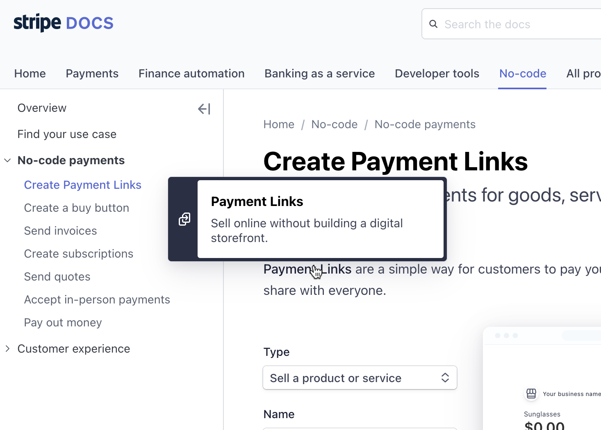

# Speakeasy OpenAPI Documentation Proposal

We'd like to propose an implementation plan for the Speakeasy OpenAPI Documentation project.

We recommend creating a Docusaurus static site, structured as follows:

```bash
├── Home Page and Introduction
├── example/
│   ├── Overview of the Speakeasy Bar API example app.
│   ├── Links to hosted documentation.
│   └── Working online dummy server.
├── glossary/
│   └── Glossary generated from a YAML file.
├── guides/
│   └── List of step-by-step guides.
├── specification/
│   └── Detailed specification reference document.
├── tips/
│   └── Best practices, tips, advice on using OpenAPI.
└── tutorials/
    ├── OpenAPI Design-First Tutorial.
    └── API-first OpenAPI Tutorial.
```

## Complete Example API

Based on the [openapi.yaml](./openapi.yaml) document, we can generate server-side stubs with minimal logic as an open source TypeScript app to run in a serverless environment.

Speakeasy could host a working example that allows users to make API calls as they explore the documentation and generated SDKs.

This could live under a separate GitHub org, called "The Speakeasy Bar" or similar, and welcome fixes from other developers.

In the docs, we should add an [overview of this example](./example/README.md).

## Glossary

We propose creating a glossary of OpenAPI concepts as a YAML file that we use to generate a [glossary page](./glossary/README.md) in the documentation.

Create a [Remark plugin](https://github.com/remarkjs/remark/blob/main/doc/plugins.md#create-plugins) and mark up glossary terms in the documentation to provide hover-for-definition interaction. There is also the option of using `@grnet/docusaurus-terminology` for this.

For an example, see [Stripe's docs](https://docs.stripe.com/no-code/payment-links) (hover the "Payment Links" link):



Tooling could improve consistency, finding keywords to mark up.

## Guides

We propose creating [multiple step-by-step guides](./guides/README.md) for specific actions a developer might search for. For example:

- How to add a webhook using OpenAPI.
- How to add a list as a path parameter in OpenAPI.
- Add SDK generation to your CI/CD workflows.
- Lint and edit documentation strings in your OpenAPI documents.
- How to generate API documentation using Redoc.
- How to add Redoc-generated OpenAPI documentation to Docusaurus.
- How to validate your OpenAPI document as part of CI/CD.
- etc.

To start with, two guides would be enough.

## Specification

A detailed [reference document](./specification/README.md), most of which is already written in [README.md](./README.md).

## Tips and best practices

Repurpose content from the blog, and write more best practices and tips articles. Or simply link to the blog posts and keep publishing there.

## Tutorials

Two detailed [tutorials](./tutorials/README.md):

1. OpenAPI Design-First Tutorial: Design a small API using OpenAPI, and generate SDKs, server stubs, and documentation.
2. API-first OpenAPI Tutorial: Create an OpenAPI document to describe an existing API.
