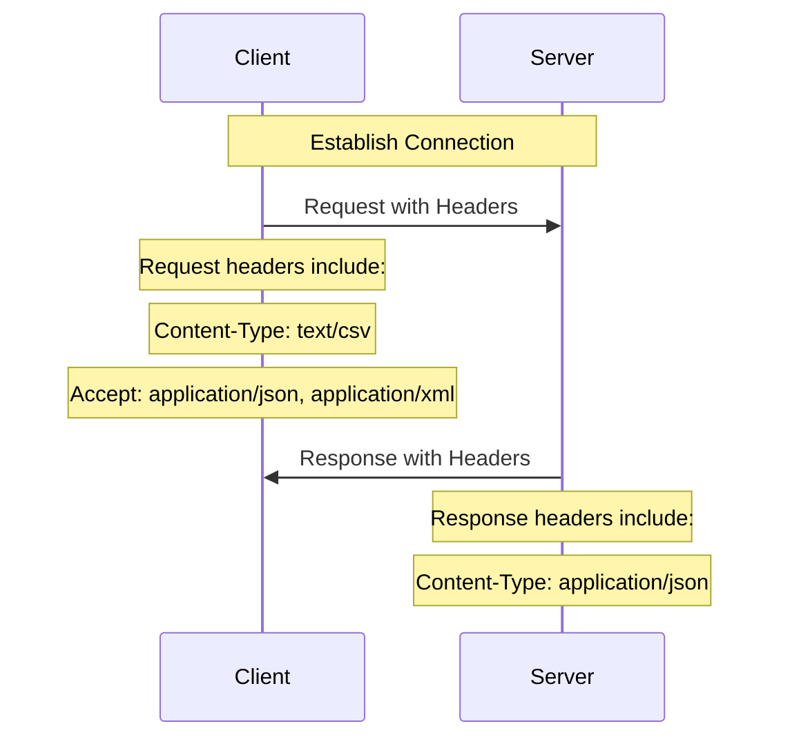

# Content and Media Types in OpenAPI

In OpenAPI 3.1, the `content` keyword indicates the media types required in request bodies or returned by responses. Media types are often referred to as content types or MIME types, but we'll use media types in this document.

Media types in OpenAPI inform the client how to interpret data received from the server, and which data types the server expects from the client.

Common examples of media types include:

- `application/json` for JSON objects.
- `text/plain` for plain text.
- `image/png` for PNG image files.
- `application/xml` for XML files.
- `multipart/form-data` for form data that can include files.

## Content Map

The `content` object is a map of key-value pairs.

Each key in the map is a [media or MIME type](https://developer.mozilla.org/en-US/docs/Web/HTTP/Basics_of_HTTP/MIME_types) like `application/json`, `text/plain`, or `image/png`.

The value associated with each key is a [Media Type Object](#media-type-object) that describes the structure and other relevant details for its corresponding media type.

Media type keys can include wildcards indicating a range of media types they cover. For example, `application/*` would match `application/json`, `application/xml`, and so on, and `*/*` would match any media type. It can be explicitly defined to match only a single media type, for example, `application/json; charset=utf-8`.


**Avoid wildcard media types where possible:** While using wildcards in defining content types is convenient, it might lead to ambiguous results if the client and server do not handle the same range of media types. Use specific media types where possible to avoid ambiguity.


Where both a wildcard and a specific media type are defined, the specific media type definition takes precedence.

The example below shows a `content` map with four media types:

```yaml
content:
  application/json: # JSON formatted content
    schema:
      $ref: "#/components/schemas/Drink"
  img/*: # Image formatted content of any type
    schema:
      type: string
      format: binary
  text/*: # Text-based content of any type
    schema:
      type: string
  text/csv: # CSV formatted content (this will take precedence over text/*)
    schema:
      $ref: "#/components/schemas/Drink"
```

In this example, the server expects one of the following types:

- A JSON object representing a drink.
- Any image file in binary format.
- A CSV file representing a drink.
- Any text file.

## Content Negotiation

When the client sends a request to the server, it includes a `Content-Type` HTTP header in the request, indicating to the server how to interpret the data in the body of the request.

Likewise, the server includes a `Content-Type` HTTP header in its response, which the client should use to interpret the data in the response.

The client may also include an `Accept` HTTP header in a request, indicating to the server which content types the client can handle. The server should then send a response with a `Content-Type` header that matches one of the accepted types. This exchange is known as [content negotiation](https://developer.mozilla.org/en-US/docs/Web/HTTP/Content_negotiation).

The diagram below illustrates the headers sent by the client and server during content negotiation:



Note that the request and response content types do not need to match. For example, in the diagram above, the client sends a request as CSV but expects JSON or XML in response.

## Media Type Object

A Media Type Object describes the request or response for a media type, with optional examples and extensions.

| Field      | Type                                                                                                                         | Required | Description                                                                                                                                                                                                                                                                                                                                                                      |
| ---------- | ---------------------------------------------------------------------------------------------------------------------------- | -------- | -------------------------------------------------------------------------------------------------------------------------------------------------------------------------------------------------------------------------------------------------------------------------------------------------------------------------------------------------------------------------------- |
| `schema`   | [Schema Object](../../schemas.md)                                                                                            |          | A schema that describes the request or response content.                                                                                                                                                                                                                                                                                                                         |
| `examples` | Map[string, [Example Object](../../examples.md) \| [OpenAPI Reference Object](../../references.md#openapi-reference-object)] |          | Optional examples of the media type. These examples override any examples from the [Schema Object](../../schemas.md) in the `schema` field. Mutually exclusive with the `example` field.                                                                                                                                                                                         |
| `example`  | Any                                                                                                                          |          | An optional example of the media type. This example overrides any examples from the [Schema Object](../../schemas.md) in the `schema` field. Mutually exclusive with the `examples` field. Deprecated in OpenAPI 3.1 in favor of `examples`.                                                                                                                                     |
| `encoding` | Map[string, [Encoding Object](./requests.md#encoding-object)]                                           |          | An optional map of [Encoding Objects](./requests.md#encoding-object). Each Encoding Object's key should match one of the properties from the [Schema Object](../../schemas.md) in the `schema` field. Only applies to [Request Body Objects](./requests.md) when the media type is `multipart` or `application/x-www-form-urlencoded`. |
| `x-*`      | [Extensions](../../extensions.md)                                                                                            |          | Any number of extension fields as required by tooling and vendors.                                                                                                                                                                                                                                                                                                               |

## Media Type Examples

The examples below illustrate the use of the `content` object with different media types.

### JSON Media Type

The example below shows a `content` object with a JSON media type:

```yaml
content:
  application/json:
    schema:
      $ref: "#/components/schemas/Drink"
    examples:
      mojito:
        value:
          name: "Mojito"
          ingredients:
            - name: "White Rum"
              quantity: 50
            - name: "Lime Juice"
              quantity: 20
            - name: "Mint Leaves"
              quantity: 10
```

In this example, the server expects a JSON object representing a drink. The `examples` field provides an [Example Object](../../examples.md) of the expected JSON object.

The curl command below sends a request to the server with a JSON object in the body:

```bash
curl -X POST "https://api.example.com/drinks" \
     -H "Content-Type: application/json" \
     -d '{
           "name": "Mojito",
           "ingredients": [
             {
               "name": "White Rum",
               "quantity": 50
             },
             {
               "name": "Lime Juice",
               "quantity": 20
             },
             {
               "name": "Mint Leaves",
               "quantity": 10
             }
           ]
         }'
```

### Image Media Type

The example below shows a `content` object with an image media type:

```yaml
content:
  image/png:
    schema:
      type: string
      format: binary
```

In this example, the server expects an image file in binary format.

The curl command below sends a request to the server with an image file in the body:

```bash
curl -X POST "https://api.example.com/images" \
     -H "Content-Type: image/png" \
     --data-binary @image.png
```

### Text Media Type

The example below shows a `content` object with a text media type:

```yaml
content:
  text/plain:
    schema:
      type: string
```

In this example, the server expects a plain text file.

The curl command below sends a request to the server with a text file in the body:

```bash
curl -X POST "https://api.example.com/text" \
     -H "Content-Type: text/plain" \
     -d "Hello, World!"
```

### CSV Media Type

The example below shows a `content` object with a CSV media type:

```yaml
content:
  text/csv:
    schema:
      $ref: "#/components/schemas/Drink"
```

In this example, the server expects a CSV file representing a drink.

The curl command below sends a request to the server with a CSV file in the body:

```bash
curl -X POST "https://api.example.com/csv" \
     -H "Content-Type: text/csv" \
     -d "Mojito,White Rum,50,Lime Juice,20,Mint Leaves,10"
```

### Multipart Form Data

The example below shows a `content` object with a multipart form data media type:

```yaml
content:
  multipart/form-data:
    schema:
      properties:
        photo:
          description: A photo of the drink.
          type: string
          format: binary
        recipe:
          description: The recipe for the drink.
          type: string
        name:
          description: The name of the drink.
          type: string
    encoding:
      photo:
        contentType: image/jpeg, image/png
        headers:
          Content-Disposition:
            description: Specifies the disposition of the file (attachment and file name).
            schema:
              type: string
              default: 'form-data; name="photo"; filename="default.jpg"'
        allowReserved: false
      recipe:
        contentType: text/plain
        headers:
          Content-Disposition:
            description: Specifies the disposition of the file (attachment and file name).
            schema:
              type: string
              default: 'form-data; name="recipe"; filename="default.txt"'
        allowReserved: false
      name:
        contentType: text/plain
        headers:
          Content-Disposition:
            description: Specifies the disposition of the field.
            schema:
              type: string
              default: 'form-data; name="name"'
        allowReserved: false
```

In this example, the server expects a form data request with a photo of the drink, the recipe for the drink, and the name of the drink. The `encoding` field provides additional information about each part, such as the content type, headers, and whether reserved characters are allowed.

The curl command below sends a request to the server with a photo file, a recipe file, and the name of the drink in the body:

```bash
curl -X POST "https://api.example.com/drinks" \
     -F "photo=@photo.jpg;type=image/jpeg" \
     -F "recipe=@recipe.txt;type=text/plain" \
     -F "name=Mocktail"
```

## OpenAPI Content Best Practices

When designing APIs with OpenAPI, consider the following best practices for content and media types:

- Where possible, use the most specific media type for your content. For example, prefer `application/json` over `application/*` if your content is JSON.
- When using OpenAPI 3.1, provide at least one example for each media type using the `examples` keyword to help clients understand the expected content and enrich the API documentation.
